# Phase 7.1 — Production Customer Authentication & Windows Client ↔ Entra Integration

**Status: ARCHITECTURE / DESIGN ONLY.** No source code, migration, API endpoint, UI,
configuration, CI workflow, or dependency was added or modified. This document is the
sole deliverable. Implementation does not begin until this document is separately
reviewed and explicitly approved.

---

## 1. Executive summary

Phase 7.0 made the backend capable of authenticating a customer via Microsoft Entra
External ID, resolving/gated-provisioning an `Account`, enforcing account-status,
and serving `Profile` — entirely server-side, entirely tested. Direct inspection of
the repository at the frozen Phase 7.0 baseline (commit `781cd33`) shows that **none
of this is yet reachable from the Windows client**: `VTTranslate.App` has no reference
to any `VTTranslate.Backend.*` project, no MSAL package, no HTTP client, and no
authentication code of any kind. Its `MainViewModel` constructs
`AzureSpeechTranslationProvider` **directly**, using a raw `AZURE_SPEECH_KEY`
environment variable read by `VTTranslate.Core.Config.AppSettings` — the exact
long-lived Azure master key Phase 6.8's Provider Access Gateway exists specifically to
keep off any client.

Phase 7.1 designs the Windows client's authentication architecture end to end: Entra
External ID application registration for a public desktop client, Authorization Code +
PKCE via MSAL.NET, a DPAPI-backed MSAL token cache, the client-side service/interface
boundary, the bounded 401-retry policy, account-status UX handling, and the exact
integration seams through which the client will eventually call the already-frozen
device/provider-access/translation-session endpoints. It also names, without solving,
the concrete pre-existing gap this inspection surfaces: the client's current
direct-provider-key code path must be retired as part of (not after) this work, or the
authentication layer designed here protects nothing.

## 2. Starting repository state

Verified directly, not assumed:

- **Branch**: `master`.
- **HEAD**: `781cd338c49811367b30a93ccfd6c3b036019c8e` (`781cd33`) — matches the
  commit specified as the Phase 7.0 baseline exactly.
- **Working tree**: clean at the start of this phase (the only untracked artifact
  present was this document's own prior in-progress draft at the same path, which this
  version supersedes).
- **This confirms**: the repository is at the expected, completed Phase 7.0 state —
  no drift, no partial work, no unexpected local modifications to reconcile before
  designing against it.

### 2.1 What actually exists (backend), inspected directly

- **`src/VTTranslate.Backend.Domain/Abstractions/IIdentityProvider.cs`** —
  `AuthenticatedPrincipal(Provider, ExternalSubjectId, Email, EmailVerified,
  DisplayName, IssuedAt, ExpiresAt)`. No role, no `AccountId`, no device information —
  by design, so "unknown/missing role claim" is structurally impossible as an attack
  surface rather than mitigated after the fact.
- **`src/VTTranslate.Backend.Infrastructure/Identity/EntraIdentityProvider.cs`** — maps
  already-verified claims (`sub`/`oid`, `email`/`preferred_username`,
  `email_verified`, `name`, `iat`/`exp`) into `AuthenticatedPrincipal`. Cryptographic
  verification (signature/issuer/audience/lifetime) happens upstream, entirely inside
  standard `Microsoft.AspNetCore.Authentication.JwtBearer` middleware — this class
  never parses or validates a token itself.
- **`src/VTTranslate.Backend.Api/Security/AccountResolutionMiddleware.cs`** — runs
  after `UseAuthentication()`, before `UseAuthorization()`. On
  `AccountResolutionOutcome.AccountNotFound` (Phase 6.4), it now (Phase 7.0) calls
  `IAccountProvisioningService.ProvisionAsync` as the sole provisioning call site; a
  successful outcome stashes the resulting `Account` in `HttpContext.Items`, an
  unsuccessful one returns the same `403 account_not_found` shape that existed before
  Phase 7.0 — deliberately uniform, anti-enumerating.
- **`IAccountResolutionService`/`AccountResolutionService`** — resolves by
  `(ExternalIdentityProvider, ExternalSubjectId)` only, **never** by email; three
  outcomes: `Resolved`, `AccountNotFound`, `AccountSuspended` (covers every non-usable
  `AccountStatus` via `Account.IsUsable`). Unchanged in shape by Phase 7.0 — pure
  resolution only.
- **`IAccountProvisioningService`/`AccountProvisioningService`** (Phase 7.0) — gated
  JIT: `Enabled` → `RequireEmailVerified` (checked against
  `AuthenticatedPrincipal.EmailVerified`, never a client-asserted value) → a
  per-identity `(Provider, ExternalSubjectId)`-keyed rate limit
  (`IProvisioningRateLimiter`) → one atomic transaction creating `Account` + `Profile`
  + an `AccountProvisioned` `AuditEvent`. A concurrent loser's insert collides with the
  database's own unique index on `(ExternalIdentityProvider, ExternalSubjectId)`,
  translated to `DuplicateIdentityException`; the transaction rolls back cleanly and a
  fresh read resolves the winning `Account` — proven by a real-PostgreSQL 10-way
  concurrency test (`ConcurrentFirstLogin_SameIdentity_CreatesExactlyOneAccount_RealPostgres`).
- **`IAccountLifecycleService`/`AccountLifecycleService`** (Phase 7.0) —
  `Activate`/`Suspend`/`Disable`/`Close`, enforcing the approved transition matrix
  (`Closed` is terminal; same-state calls are idempotent no-ops); audits every real
  transition. **Not wired to any API endpoint** — no admin API exists yet, by design.
- **`AccountStatus`** (Phase 7.0 extension) — `Pending`, `Active`, `Suspended`,
  `Disabled`, `Closed`. Only `Active` is usable (`Account.IsUsable`); every other value
  denies identically at `AccountResolutionMiddleware`'s existing gate — the client
  cannot distinguish which non-`Active` state applies from the response alone.
- **`IProfileService`/`ProfileService`** (Phase 7.0) + `GET /profile`/`PUT /profile` —
  `AccountId` sourced exclusively from `AccountResolutionMiddleware`; `DisplayName`
  length-validated, `PreferredLanguagePair` shape-validated
  (`^[a-z]{2}-[A-Z]{2}:[a-z]{2}-[A-Z]{2}$`).
- **Customer JWT scheme** (`Program.cs`) — default scheme, `Identity:Authority`/
  `Identity:Audience` (both non-secret, empty-committed, environment-supplied),
  `MapInboundClaims = false`, `ValidateIssuer`/`ValidateAudience`/`ValidateLifetime`/
  `ValidateIssuerSigningKey` all at framework defaults.
- **`AdminScheme`** (Phase 7.0) — a second, named `JwtBearer` scheme validating
  `Identity:Admin:Authority`/`Identity:Admin:Audience`, entirely separate from the
  customer scheme's configuration namespace (the customer keys were left unchanged, not
  renamed). A dedicated `"AdminScheme"` authorization policy gates one
  boundary-proof-only placeholder route (`/internal/admin-boundary`) — no admin API
  exists yet. Verified (by test) that a customer-audience token cannot satisfy it and
  vice versa.
- **Device licensing** (`POST /devices`, `POST /devices/{id}/revoke`, Phase 6.7,
  frozen) — pooled `MaxActiveDevices`, server-generated `Device.Id`, account-based
  identity (explicitly **not** hardware-fingerprint-based per Phase 6.2B §6), a real
  PostgreSQL row-lock (`LockAccountForDeviceRegistrationAsync`) closing the
  registration race.
- **Provider access** (`POST /provider-access`, Phase 6.8, frozen) —
  `AzureProviderCredentialIssuer` mints a short-lived Azure STS token; the long-lived
  master key never leaves Infrastructure. `/provider-access` never creates usage.
- **Translation session** (`POST /translation-sessions`, `.../heartbeat`, `.../end`,
  Phase 6.9, frozen) — server-derived duration, lease-based lazy expiry, idempotent
  heartbeat/end, `clientSessionId`-keyed idempotent start/reconnect.
- **Usage accounting** (Phase 6.9, frozen) — written only at explicit `End` or lazy
  expiry reconciliation, via `IUsageService.RecordServerDerivedUsageAsync`; never at
  session start, never from `/provider-access`.

### 2.2 What actually exists (Windows client), inspected directly

- **`src/VTTranslate.App/VTTranslate.App.csproj`** — exactly one
  `<ProjectReference>`: `VTTranslate.Core`. No `VTTranslate.Backend.*` reference, no
  `Microsoft.Identity.Client` (MSAL.NET) package, no HTTP-client-specific package, no
  WebView2/embedded-browser package.
- **`src/VTTranslate.App/MainViewModel.cs`** (lines ~215/227) — constructs
  `new AzureSpeechTranslationProvider(Settings.AzureSpeechKey!,
  Settings.AzureSpeechRegion!, "<voice>", _diagnosticLogger)` **directly, twice** (one
  per translation direction). No `HttpClient`, no `Authority`, no `ClientId`, no token
  acquisition anywhere in this file.
- **`src/VTTranslate.Core/Config/AppSettings.cs`** —
  `AzureSpeechKey => GetEnv("AZURE_SPEECH_KEY")`: the long-lived Azure Cognitive
  Services master key is read straight from a local environment variable on the
  machine running the WPF app. This is the pre-commercial MVP design (Phase 1–5,
  predating any backend) and is untouched by any Phase 6.x/7.0 work — `VTTranslate.Core`
  remains, correctly, entirely independent of and unaware of the backend.
- **No `VTTranslate.App.Tests`-equivalent project exists.**

### 2.3 What Phase 7.0 explicitly left as future work (confirmed by its own document)

`docs/phase-7.0-production-identity-and-account-lifecycle.md` §37 already named
"Windows client authentication flow implementation" as a downstream step gated on the
provisioning decision being stable — which it now is. Phase 7.1 is exactly that next
designed step.

**Conclusion**: nothing in the backend requires change for Phase 7.1 to be
implementable. Everything client-side must be *added*, and one existing client-side
code path (§18) must eventually be *removed*.

## 3. Existing Phase 7.0 architecture (frozen contracts this phase builds on)

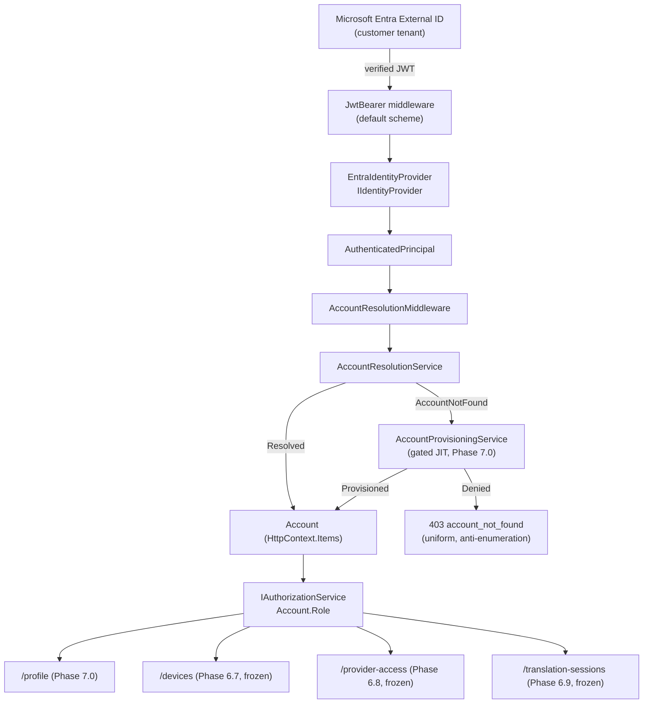

Every box below `Account` is unchanged by Phase 7.0 and remains unchanged by Phase
7.1's design — this phase adds nothing above `Entra External ID` and nothing new
between `Entra` and `AccountResolutionMiddleware`; it designs the client-side
component that produces the verified JWT arriving at `JwtBearer` in the first place.

## 4. Goals

- Design a production-safe Windows client authentication architecture: Entra
  application registration, redirect-URI mechanism, PKCE flow, MSAL.NET integration,
  and secure token cache — implementation-ready, not implemented.
- Design the client-side abstraction boundary so authentication never leaks into
  `VTTranslate.Core`'s audio/translation code.
- Design bounded 401 handling, logout, multi-instance behavior, and account-status UX
  consistent with the backend's server-authoritative, anti-enumerating design.
- Design the integration seams for device registration, provider access, and
  translation-session calls without altering their frozen server-side semantics.
- Produce a Mermaid-diagrammed threat model, decision matrix, and test architecture an
  implementation phase can build directly from.
- Explicitly name every open product decision rather than silently resolving it.

## 5. Non-goals

- No source code, package reference, `.csproj`, `Program.cs`, `appsettings`, migration,
  CI workflow, or existing test change (per explicit instruction).
- No redesign of Phase 6.4/7.0 backend authentication, Phase 6.6 billing, Phase 6.7
  device licensing, Phase 6.8 provider access, or Phase 6.9 usage metering.
- No Android/iOS implementation — shared principles only (§32 numbering follows the
  master prompt's own document-format section list, reproduced faithfully below).
- No admin-client or admin-API design — Phase 7.0's boundary is reused as-is.
- No production tenant IDs, redirect URIs, client IDs, or domains invented.
- No WPF UI redesign — only the architectural seam for login/account-status UX.
- No new incompatible error model — Phase 7.0's existing response shapes are reused
  and mapped, not replaced.
- No implementation of any of the fourteen items enumerated in §37 (Non-Goals).

## 6. System context

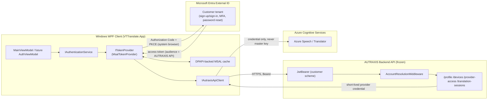

The Windows client owns everything left of the `Backend` boundary; everything at and
right of it is Phase 6.4–7.0, unchanged.

## 7. Authentication sequence

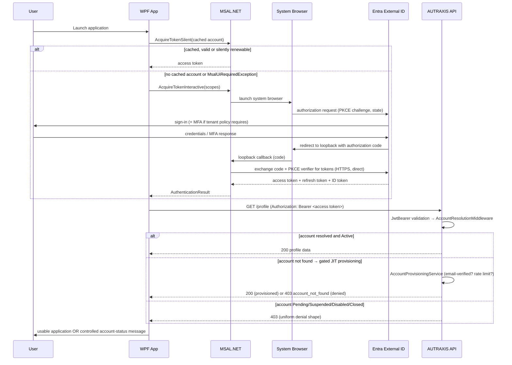

Steps annotated for completeness against the master prompt's enumerated flow
(application startup; existing-session detection; interactive login; browser launch;
Entra auth; MFA when tenant policy requires it; authorization code; PKCE verification;
token acquisition; token cache; access-token use; backend API call; account
resolution; JIT provisioning interaction; account-status enforcement) are all
represented above or in §21 (startup) and §16 (account-status handling) specifically.
Logout, re-login, expiration, silent renewal, and interactive fallback are detailed in
§12 and §21.

## 8. Entra External ID architecture

- **Boundary A — customer identity**: Entra External ID customer tenant, one public
  client application registration per environment (§27), the existing customer JWT
  scheme (`Identity:Authority`/`Identity:Audience`, unchanged).
- **Boundary B — workforce/admin identity**: a *separate* Entra tenant (Phase 7.0 §12,
  unchanged), the existing `AdminScheme` (`Identity:Admin:Authority`/
  `Identity:Admin:Audience`). Phase 7.1 does not touch this boundary — it is reused
  exactly as-is, and the Windows **customer** client never acquires or holds an admin
  token under any circumstance; no code path in this design requests the admin
  audience.
- **CUSTOMER/ADMIN/SUPER_ADMIN separation** (Phase 6.2B/6.4, unchanged): preserved
  structurally, not by convention — `Account.Role` is the sole source, never a token
  claim, and the customer client's scope request (§13) can never yield a token that
  satisfies the `AdminScheme` policy (different issuer, different audience, different
  signing-key set).
- **No custom AUTRAXIS JWT.** See §33 decision 13 for the explicit rejection rationale.

## 9. MSAL.NET architecture

**Recommendation: MSAL.NET (`Microsoft.Identity.Client`) +
`Microsoft.Identity.Client.Extensions.Msal`** for cache persistence (§11) — the
Microsoft-maintained, standards-based library purpose-built for exactly this scenario
(public client, desktop, Authorization Code + PKCE, Entra External ID). Hand-rolling
an OAuth2/PKCE/OIDC client would contradict the repeated, explicit instruction (Phase
6.4 §14, Phase 7.0 §4/§12, this phase's §40 principle 15) to use standard
framework-supported authentication rather than custom cryptographic/protocol code.

**Public-client configuration** (conceptual — no code): one `IPublicClientApplication`,
built once per process at startup:
- `ClientId` — this environment's registered customer application ID (§13/§26).
- `Authority` — this environment's Entra External ID tenant authority URL
  (environment-specific client configuration, distinct from, but shaped identically
  to, the backend's own `Identity:Authority`).
- No client secret, no certificate — a public client cannot protect either (§40
  principle 13).
- Redirect URI — MSAL's default loopback listener (§10); no registry/manifest
  dependency.
- The DPAPI-backed cache extension attached at construction (§11).

**Scopes**: exactly the AUTRAXIS API's own exposed delegated scope (§13) — no
Microsoft Graph scope, no other resource's scope, ever requested.

**Account discovery**: `IPublicClientApplication.GetAccountsAsync()` enumerates
cached `IAccount`s (§22); the application tracks the most-recently-used account
identifier for `AcquireTokenSilent`'s account hint.

**Token acquisition pattern**: always `AcquireTokenSilent(scopes, account)` first;
fall back to `AcquireTokenInteractive(scopes)` only on `MsalUiRequiredException`. This
one pattern covers first login (no cached account → immediately falls through),
normal renewal, and post-revocation recovery uniformly (§12).

**Cancellation**: `CancellationToken` plumbed through both acquisition calls; a
user-cancelled interactive flow surfaces as a specific `MsalClientException`
(operation-cancelled), mapped to `authentication_cancelled` (§30) — never a generic
failure.

**Concurrency**: MSAL.NET's own `IPublicClientApplication`/token-cache implementation
is documented as thread-safe for concurrent `AcquireTokenSilent` calls; the
architecture does not add a redundant application-level lock around it (§10 discusses
the one place additional coordination is warranted: concurrent *interactive* prompts).

**Client-side abstraction** (interfaces only, not implemented here):

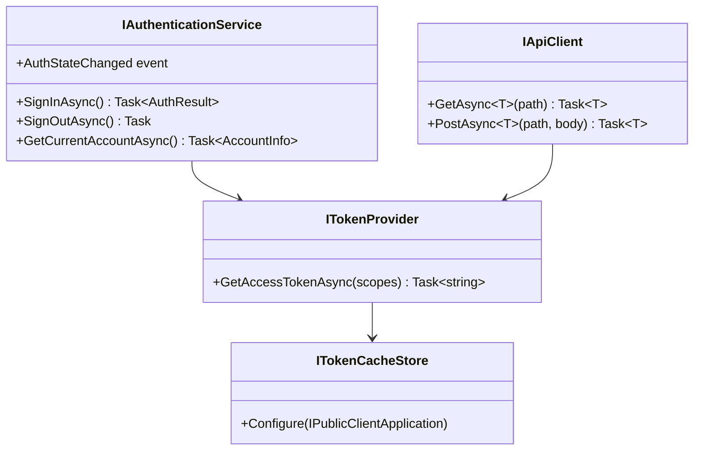

`ITokenProvider` is the single seam that makes MSAL's own types (and the browser
interaction inside `AcquireTokenInteractive`) entirely invisible above it — see §33
decision matrix item on testability, and Phase 7.1's own §29 test architecture.

## 10. Redirect URI decision

| Mechanism | Security | Interception risk | Windows compatibility | Multiple installed instances | Firewall behavior | Enterprise environments | Packaging | Dev vs. prod |
|---|---|---|---|---|---|---|---|---|
| **A. Loopback (`http://localhost:{ephemeral port}/…`) — RECOMMENDED** | PKCE (§40 principle) is the actual interception defense, not the redirect scheme itself; loopback is Microsoft's own documented, MSAL-native pattern for public desktop clients and is RFC 8252-endorsed | Low — a locally bound, ephemeral-port listener alive only for the duration of one login attempt; no persistent service, no scheme-squatting surface | Works on every supported Windows version with zero registration step | Each instance binds its own ephemeral port via MSAL's own retry logic — no shared-port collision (§22) | Loopback traffic (127.0.0.1) is not subject to typical outbound-firewall/proxy restrictions the way an external callback host would be | No corporate-proxy interception concern, since the callback never leaves the local machine | Works identically unpackaged or under a future MSIX package — zero manifest dependency | Identical mechanism in both; only `Authority`/`ClientId` differ |
| B. Custom URI scheme (e.g. `autraxis://auth`) | Requires OS-level uniqueness of the registered scheme; on an unpackaged Win32 exe, another (malicious) application registering the same scheme first can intercept the callback — a real, documented desktop-OAuth risk class | Higher — scheme-squatting is specifically a risk for unpackaged Windows executables | Requires a registry-based protocol-handler registration (or MSIX declarative activation) | Multiple installed copies registering the same scheme is itself an unresolved conflict this mechanism does not gracefully handle | N/A | Registry writes may be restricted/flagged in locked-down enterprise images | Cleaner only under MSIX; messier for a plain exe | Would need a distinct scheme per environment to avoid dev/prod collision — extra registration complexity |
| C. Broker / WAM (Web Account Manager) | Strong when available — delegates to the OS's own account broker, avoiding a browser redirect entirely for some flows | Very low, but only where WAM is actually available and configured (not universally guaranteed across all Windows 10/11 configurations for a non-Microsoft-Store app) | Partial — WAM support varies by Windows version/configuration and is more reliably available for MSIX/Store-distributed apps | N/A | N/A | Best fit for managed/enterprise-joined devices with a configured broker | Strongest under MSIX/Store distribution — not yet a committed packaging decision (§26) | Not recommended as the *primary* mechanism until MSIX packaging is a committed decision |
| D. Embedded browser callback | Explicitly disallowed — Phase 7.0 §14 already forbids an embedded browser for exactly this flow; loses the system browser's own credential-manager/passkey/session-reuse benefits and increases the attack surface (a WebView under the app's own control can, in principle, observe form input) | Higher | N/A | N/A | N/A | N/A | N/A | N/A |

**Recommendation: A — loopback redirect**, unchanged from the conclusion already
reached in the prior draft of this document and reconfirmed here against the fuller
evaluation criteria requested (multiple instances, firewall, enterprise environments).
**Why it wins**: no Windows registry or MSIX-manifest dependency (works identically
today, in the current unpackaged-exe shape, and under any future MSIX packaging with
zero mechanism change), it is MSAL.NET's own first-class documented pattern, its
traffic never crosses a network boundary a corporate firewall/proxy could interfere
with, and its actual interception resistance comes from PKCE — which applies
identically regardless of redirect mechanism chosen.

**Fallback mechanism**: none is architecturally required. If a future MSIX/Store
packaging decision is made, WAM (Option C) may be evaluated as an *additional*,
optional acceleration on managed devices — not a replacement for loopback, and not
designed further here (no packaging decision has been made, §34).

**Development vs. production redirect URI**: identical *mechanism* (loopback) in both
— the only difference between environments is which `Authority`/`ClientId` MSAL is
configured with (§26/§27); the loopback redirect itself requires no
environment-specific URI value to be registered differently, since Entra's own
loopback-redirect support for public clients matches on the pattern
(`http://localhost:{any port}` or a documented specific-port convention) rather than a
single fixed URI per environment. **Placeholder only** —
`http://localhost:{ephemeral-port}/` — no literal port number or real domain is
fabricated here.

**Never a wildcard redirect** — confirmed: loopback with an ephemeral, MSAL-managed
port is not a wildcard registration in the security-relevant sense (it is not an
open redirect to an attacker-chosen external host); this satisfies the explicit
instruction without contradiction.

## 11. Token cache / secure storage architecture

| Option | Verdict |
|---|---|
| Plaintext file / appsettings / source / Git | **Categorically rejected** — violates §40 principles 16–17 and the explicit instruction; no token, of any kind, in any of these locations, ever. |
| Custom-rolled encryption | **Rejected** — §40 principle 15 and Phase 7.0 §14 both require OS-native storage over invented cryptography. |
| Memory-only (no persistence) | **Rejected as the sole mechanism** — forces interactive login on every app restart for no corresponding security benefit over the DPAPI option below (DPAPI-protected data is already inaccessible to a different OS user). |
| Windows Credential Manager (direct) | Viable in principle, but MSAL.NET's own cross-platform cache abstraction is not natively Credential-Manager-shaped without extra adapter code, and offers no security advantage over MSAL's own DPAPI-backed serializer for this single-desktop-app scenario. |
| **MSAL.NET's cache, persisted via `Microsoft.Identity.Client.Extensions.Msal`'s `MsalCacheHelper`, DPAPI-backed on Windows — RECOMMENDED** | The Microsoft-maintained, MSAL-native answer to exactly this requirement; this **is** the "OS-backed storage, no custom cryptography" outcome required by §40 principle 15/16. |

**What is stored**: the serialized MSAL token cache — access token(s), refresh
token(s), ID token(s), and MSAL's own minimal per-account metadata (a stable account
identifier and username/UPN for display and multi-account support, §22) for every
account that has ever signed in on this machine/user profile and not since been
logged out (§20).

**What is encrypted**: the entire cache file, via Windows DPAPI
(`ProtectedData`/`CryptProtectData`), `DataProtectionScope.CurrentUser`.

**Which Windows identity protects it**: the currently logged-in Windows user account —
DPAPI ties the encryption key material to that user's own Windows credentials; no
AUTRAXIS-managed key exists to generate, store, or rotate.

**If the Windows user changes** (a different Windows account, or a shared machine,
§22): that user's own DPAPI key material cannot decrypt another user's cache file —
each Windows user account effectively gets its own independent, empty-until-first-login
cache, with no cross-user leakage possible at the DPAPI layer.

**After logout** (§20): the specific `IAccount` is removed from MSAL's cache via
`RemoveAsync(account)` — a targeted removal, not a blunt whole-file delete, so other
cached accounts on the same machine/user (§22) are unaffected.

**After application reinstall**: the cache file lives outside the application's own
install directory (in the user's local application-data profile, per MSAL's own
default cache-file location convention) — a reinstall does not necessarily clear it;
an explicit **uninstall-time** cleanup step is a packaging/installer decision, not an
authentication-architecture requirement, and is not designed further here (no stated
product requirement for it exists).

**Cache corruption**: MSAL's cache-consumer contract treats an unreadable/corrupted
cache as equivalent to "no cached account" — the application falls back to interactive
login; this is standard MSAL behavior, not custom recovery logic to design.

**Do access tokens need explicit persistence?** No separate persistence is designed
for access tokens alone — they live inside the same MSAL cache as everything else;
the application code never extracts and separately stores an access token string.

**Refresh-token handling**: entirely internal to MSAL — application code never reads,
stores, logs, or transmits a refresh token directly; every renewal goes through
`AcquireTokenSilent` (§12), which uses the refresh token internally without exposing
it.

**Never stored in this cache or anywhere else client-side**: `AZURE_SPEECH_KEY`/
`AZURE_TRANSLATOR_KEY`/any Gemini key/any AUTRAXIS backend secret — none of these are
Entra tokens and none belong in an MSAL cache. (§18 covers the current, separate,
pre-existing violation of the "no provider secret in the client" principle this cache
design itself does not touch.)

## 12. Token lifecycle

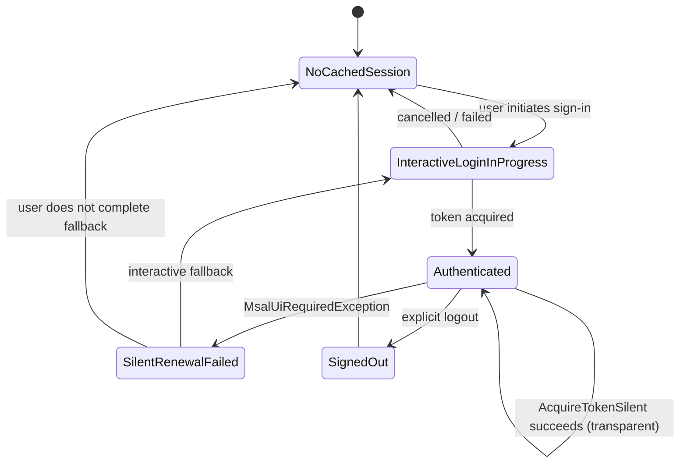

- **Access-token lifetime**: entirely Entra-tenant-controlled (commonly on the order
  of 60–90 minutes by default, but this is a **tenant configuration value, never an
  architectural constant**) — the client never tracks or assumes an expiry itself; it
  always calls `AcquireTokenSilent` fresh before each API call.
- **Refresh-token behavior**: **not permanent** — subject to the tenant's configured
  maximum lifetime and inactivity expiry, and revocable at any time (admin action,
  password reset, Conditional Access re-evaluation, detected risk). The client must
  always be prepared for silent acquisition to fail.
- **401 retry policy** (bounded, per explicit instruction):

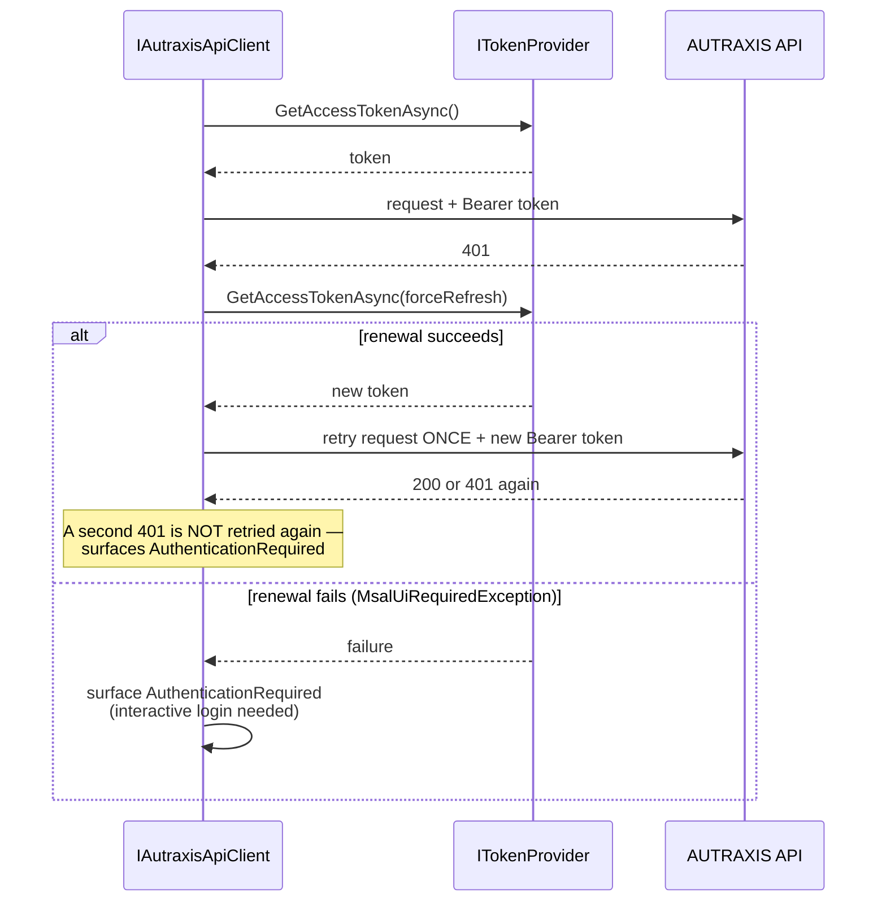

  A hard maximum of **one** silent-renew-and-retry cycle per original logical request
  — never an unbounded loop, never a retry storm. A second consecutive `401` after a
  successful renewal is treated as `authentication_failed`/`authentication_required`
  (§30), not retried again.

- **Concurrent requests discovering an expired token simultaneously**: MSAL.NET's own
  cache/acquisition implementation coalesces concurrent `AcquireTokenSilent` calls for
  the same account safely (no duplicate refresh-token redemption race at the MSAL
  layer) — the architecture relies on this existing, documented MSAL guarantee rather
  than adding a redundant application-level single-flight lock around silent
  acquisition. **Concurrent *interactive* prompts**, however, must be explicitly
  serialized at the `IAuthenticationService` layer (a simple in-process guard: if an
  interactive flow is already in progress, a second caller awaits its result rather
  than launching a second browser window) — this is the one place this design adds
  coordination beyond what MSAL already guarantees, because launching two competing
  system-browser windows for one user is a real, visible defect, not merely an
  efficiency concern.
- **Revoked session / disabled/suspended/closed account**: a revoked Entra session
  surfaces as a silent-renewal failure (handled above); an `Active`-but-backend-denied
  account (Suspended/Disabled/Closed) surfaces as a `403` from the *backend*, not from
  MSAL at all — these are two independent failure axes (§14/§16), never conflated.
- **Invalid audience / invalid issuer / insufficient scope**: these are backend-side
  validation outcomes (already covered by Phase 6.4/7.0's existing, unchanged
  `JwtBearer` configuration and tests) — the client does not attempt to
  pre-validate its own token's audience/issuer/scope; it simply presents whatever
  MSAL produced for the requested scope and reacts to the backend's response.
- **Backend 403** (as distinct from 401): never retried via token renewal — a 403
  means "authenticated, but not authorized" (§16); retrying with a fresher token
  cannot change that outcome, so the 401-renewal path is never triggered for a 403.

## 13. API audience and scopes

```
Customer client (this phase, MSAL)
        ↓ requests scope: api://<customer-api-app-id>/<customer-api-scope>
Entra External ID (customer tenant: <customer-tenant>)
        ↓ issues ACCESS TOKEN — aud = <customer-api-app-id>
AUTRAXIS Backend API (Identity:Audience = <customer-api-app-id>, UNCHANGED)
        ↓ JwtBearer: issuer / audience / signature / lifetime (standard, unchanged)
AccountResolutionMiddleware (UNCHANGED)
```

Placeholders only (no real values fabricated): `<customer-tenant>`,
`<customer-client-id>` (the WPF app's own registration), `<customer-api-app-id>` (the
backend API's registration — already implied by the existing, unchanged
`Identity:Audience`), `<customer-api-scope>` (e.g. an
`access_as_customer`-shaped delegated scope name — exact naming is an Entra-tenant
configuration detail, not fixed here).

**The client must present the ACCESS token, never the ID token, as the API bearer
token.** The ID token's audience is the client application itself (proving identity to
the client, per OIDC) — the backend's existing, unchanged `Identity:Audience`
validation would correctly reject an ID token's mismatched audience if it were ever
presented as a bearer token. This is a hard rule, not an implementation detail,
precisely because ID/access/refresh token confusion is a well-documented, real-world
OAuth misconfiguration class (§23 threat 14).

**Minimum necessary scopes only**: the client requests exactly the one customer-facing
API scope it needs — no Microsoft Graph permission, no other resource's scope, and
critically, **no application permission of any kind** is granted to this public
client (application permissions require app-only/client-credential flows, which are
categorically incompatible with a public client that has no secret — the WPF app can
only ever use *delegated* permissions, acting on behalf of the signed-in user).
Requesting broader scope than needed would violate least-privilege for no functional
benefit, since the backend never consumes any claim beyond what
`EntraIdentityProvider` already reads (§2.1).

**Admin scheme** (`Identity:Admin:*`, Phase 7.0) is a fully separate audience/issuer
this client never requests a token for — no code path in this design touches it.

## 14. Customer/admin security boundary

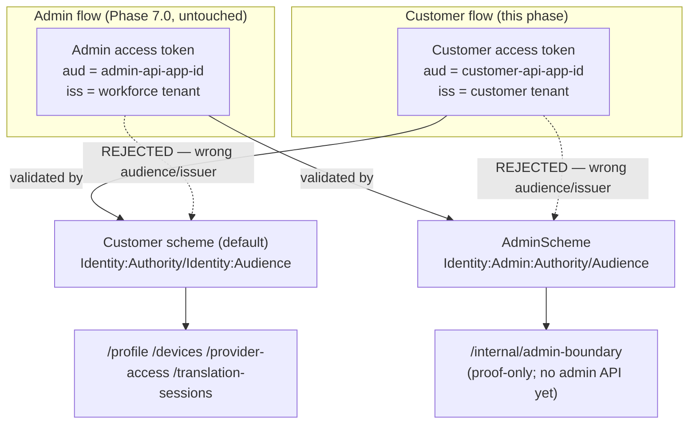

This diagram describes the **existing, frozen** Phase 7.0 boundary — Phase 7.1 adds
nothing to it and modifies nothing in it. The Windows customer client:
- never requests, holds, or presents an admin-audience token;
- cannot forge `role`/`roles` claims into elevation, because `Account.Role` (never a
  token claim) is the sole authority (Phase 6.4, unchanged, proven by
  `ClientSuppliedRoleClaimInsideJwt_CannotEscalatePrivileges` and this phase's own
  `AdminCustomerBoundaryTests`);
- cannot change `AccountId`, because it is never a request parameter anywhere in the
  backend surface this client calls (§2.1);
- cannot impersonate another account, since no impersonation mechanism exists
  (Phase 7.0 §12, explicitly not built) and this phase does not introduce one.

## 15. JIT provisioning integration

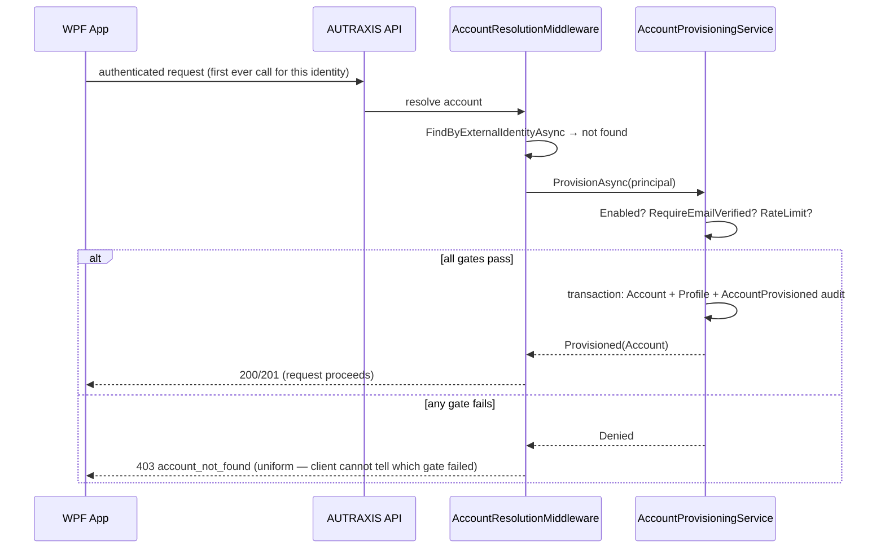

The client:
- **never** creates accounts directly — no client-callable "provision" endpoint exists
  or is proposed (Phase 7.0 §32 explicitly forbids one);
- **never** submits `AccountId` or `Role` — no request the client makes anywhere in
  this design carries either field;
- **never** decides eligibility — email verification, the enable/disable flag, and
  rate-limit state are all evaluated exclusively inside `AccountProvisioningService`;
- **never** trusts email as identity — the client has no code path that treats an
  email address as an account key at all, consistent with `(ExternalIdentityProvider,
  ExternalSubjectId)` being the sole resolution key (§2.1).

**First login**: the very first authenticated call (naturally, `GET /profile` — a
cheap, already-existing, side-effect-free probe, §16) triggers provisioning
transparently; the client does not need a distinct "first login" code path beyond
simply making its normal first authenticated call.

**Unverified identity**: denied with the same uniform `403 account_not_found` as any
other denial reason (§16's anti-enumeration rule) — the client shows one generic
message, never a specific "please verify your email" message, unless a future,
separate, explicit backend response change makes that distinguishable (not designed
here — would itself need to be weighed against the anti-enumeration posture).

**Provisioning disabled**: identical uniform denial.

**Rate limiting**: identical uniform denial — the client has no way to distinguish a
rate-limited attempt from any other denial, and must not display a
"try again in N seconds" message it cannot actually derive from the response.

**Duplicate first-login race**: entirely server-side (§2.1) — from the client's
perspective, two near-simultaneous first calls (e.g., from two app instances, §22)
both simply succeed, resolving to the same `Account`; no client-side coordination is
needed or designed.

**Provisioning failure / rollback**: server-side only (§2.1's transactional design) —
the client sees either a clean success or a clean uniform denial; it never observes a
partially-created account state, because none can exist.

**Already-existing account**: the same call path (`GET /profile` or any other
authenticated call) simply resolves normally via `AccountResolutionService` — no
distinct client behavior for "returning customer" vs. "first-time customer."

**Account status `Pending`**: denied identically to `Suspended`/`Disabled`/`Closed`
at the same gate (§16) — under the current design, `Pending` is reserved
(§2.1 confirms no code path produces it today) but the client's handling is already
correct for it regardless: any non-`Active` state produces the same uniform denial.

## 16. Account status handling

The backend's `AccountResolutionMiddleware` already returns a uniform `403` for every
non-`Active` `AccountStatus` — this is a **deliberate anti-enumeration property of the
existing backend**, not a gap for the client to work around. The client's contract:

| Backend response | Client interpretation |
|---|---|
| `200`/`201` from any endpoint | Account is `Active` and the requested operation succeeded/is authorized. |
| `403` from `AccountResolutionMiddleware`'s own gate (any non-`Active` status, or a denied provisioning attempt) | Map to `account_not_usable` (a single stable category, §30) — show one generic, safe message (e.g., "Your account isn't available right now"). **Never** attempt to distinguish `Pending` vs. `Suspended` vs. `Disabled` vs. `Closed` vs. "provisioning denied," because the backend deliberately does not tell the client which applies. |
| `403` from a role/entitlement check *after* account resolution succeeded (e.g. `entitlement_denied`, `device_not_authorized`) | These are **not** account-status denials — they are Phase 6.6/6.7/6.8's own existing, distinguishable outcome codes (unchanged), and may be surfaced more specifically per §30's error contract, since they do not carry the same anti-enumeration sensitivity as raw account existence/status. |

**The client must never infer subscription state from account status** — `Account`
and `Subscription` are independent axes by design (Phase 7.0 §18/§21: a customer with
a cancelled or expired subscription remains `Active` at the account layer; only the
`Subscription`/`Entitlement` layer denies new usage). The client's account-status
handling and its (separate, future) subscription/entitlement-denial handling must
remain two distinct code paths mapping to two distinct error categories (§30).

**The client must never bypass** `Suspended`/`Disabled`/`Closed` — concretely, if a
previously-successful silent token renewal succeeds (proving only "Entra still
recognizes this identity"), the client still makes its own fresh authenticated call
and acts on *that* response before permitting any translation-session-adjacent action;
token-renewal success is never treated as evidence of current account usability.

**Stable problem codes over fragile strings**: the client parses a stable `status`
field (already present in every backend response shape inspected in §2.1, e.g.
`{ "status": "account_not_found" }`) rather than pattern-matching human-readable text
— this is already the backend's existing response shape; Phase 7.1 does not need to
request a new one, only to consume the existing one correctly and map it via §30's
table.

## 17. Profile integration

```
Authenticated client (this phase)
        ↓ Authorization: Bearer <access token>
GET /profile / PUT /profile (Phase 7.0, UNCHANGED)
        ↓ AccountId resolved server-side, never client-supplied
{ displayName, preferredLanguagePair, updatedAt }
```

- `AccountId` is never a request parameter, header, or body field the client
  constructs — the backend's existing implementation (§2.1) already has no such
  input surface; this phase adds no new one.
- The client **cannot** alter `Role` or `Account.Status` via these endpoints — neither
  field appears in `UpdateProfileRequest`'s existing shape (`DisplayName`,
  `PreferredLanguagePair` only, per `Program.cs`, confirmed unchanged).
- Server-side validation (`DisplayName` length, `PreferredLanguagePair` shape) is
  reused as-is — the client may perform the *same* light client-side validation
  purely as a UX nicety (immediate feedback before a round-trip), but the server
  remains authoritative and re-validates regardless; the client must never assume its
  own validation is sufficient or skip the round-trip based on passing local checks.
- Profile access naturally requires an `Active` account, since it goes through the
  same `AccountResolutionMiddleware` gate as every other endpoint (§16) — no separate
  access-control design is needed for `/profile` specifically.
- Account isolation is entirely server-side and already proven (Phase 7.0's
  `ProfileEndpointTests.CrossAccount_CannotReadAnotherAccountsProfile`, unchanged) —
  the client cannot construct a request that reads another account's profile, because
  no such request shape exists.
- **The client displays profile information; it never treats it as an identity
  authority** — e.g., a cached `displayName` from a prior session must never be used
  to infer or assert `AccountId`, `Role`, or account status locally.

## 18. Device integration

```
Authenticated client (this phase)
        ↓
GET /devices / POST /devices / POST /devices/{id}/revoke (Phase 6.7, UNCHANGED)
        ↓
Pooled MaxActiveDevices enforcement, server-generated Device.Id (UNCHANGED)
```

- **Logical device identity**: the client obtains its `Device.Id` **only** from the
  backend's response to `POST /devices` (server-generated `Guid`, Phase 6.7,
  unchanged) — it never invents, derives, or hardware-fingerprints its own device
  identifier (explicitly forbidden by Phase 6.2B §6 and restated in this phase's own
  instruction).
- **Secure local storage of the device identifier**: the server-issued `Device.Id`
  itself is not secret (it identifies a device row, not a credential), but it should
  still be persisted locally in the same secure storage the client already uses for
  its authentication state (i.e., alongside/adjacent to the MSAL cache's own
  local-application-data storage, §11) rather than an easily-tampered plaintext
  settings file, purely as a matter of storage-location hygiene — not because the
  value itself is a secret requiring encryption. **Critically, this stored ID is never
  treated as proof of account ownership**: every device-scoped API call is still made
  with the current Entra access token, and the backend independently re-verifies that
  the presented `deviceId` belongs to the authenticated `AccountId` on every call
  (Phase 6.7, unchanged) — a stolen or copied local device-ID value, presented without
  the corresponding valid access token, authorizes nothing.
- **Prevented by the existing backend design, confirmed unchanged**: client-supplied
  `AccountId` (no such parameter exists on any device endpoint), cross-account device
  access (`device_not_authorized`, non-enumerating, Phase 6.7, unchanged, proven by
  `CrossAccountDevice_Denied_NeverLeaksOwnership`), arbitrary device impersonation
  (a `deviceId` not owned by the authenticated account is indistinguishable from a
  nonexistent one, per that same test).
- **Concurrency**: the existing `LockAccountForDeviceRegistrationAsync` PostgreSQL row
  lock (Phase 6.7, unchanged) already closes the pooled-registration race — no new
  client-side coordination is needed; if two app instances (§22) register
  simultaneously, the backend's existing lock decides the outcome correctly.

## 19. Provider access integration

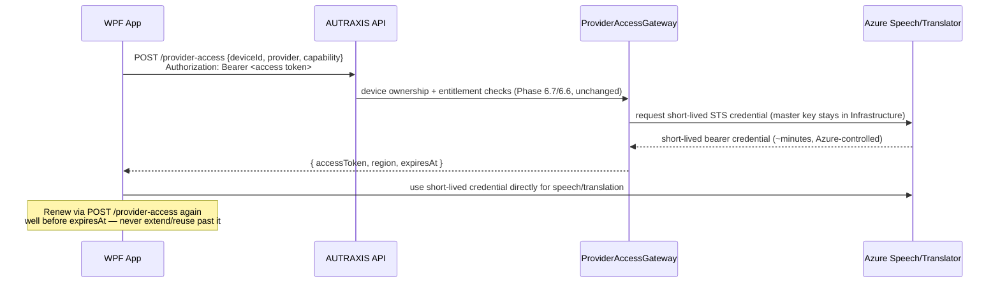

The production WPF client must not, and per this design will not, contain: an Azure
Speech master key, an Azure Translator master key, a Gemini API key, a provider
client secret, or any provider administrative credential — all of these remain
exclusively inside `AzureProviderCredentialIssuer` (Phase 6.8, Infrastructure layer,
unchanged).

- **Lifetime**: the short-lived credential's lifetime is whatever Azure's own STS
  response dictates (Phase 6.8's existing behavior — e.g., Azure Speech issues tokens
  with a fixed lifetime regardless of what was requested); the client treats
  `expiresAt` from the response as authoritative, never assuming a fixed duration.
- **Storage**: **memory-only** — this credential is never written to the MSAL cache,
  never persisted to disk, never logged. It exists only for the duration it is
  actively being used to call Azure, held in application memory for that span alone.
- **Renewal**: the client schedules a fresh `POST /provider-access` call before the
  current credential's `expiresAt`, using its now-standard authenticated-request path
  (§20) — this is new client-side scheduling logic this phase introduces, not a
  change to Phase 6.8's issuance behavior.
- **Expiration**: an expired credential is simply unusable against Azure (Azure's own
  enforcement, outside AUTRAXIS's control) — the client does not attempt to detect
  expiry proactively beyond its own renewal schedule; a failed Azure call due to an
  expired credential triggers an immediate renewal attempt.
- **Inability to revoke Azure's already-issued bearer token**: once issued, Azure's
  own STS token cannot be revoked early by AUTRAXIS — this is an inherent property of
  the short-lived-credential model (Phase 6.8's own documented design, unchanged); the
  bound is the credential's own short lifetime, not revocability. This is why the
  lifetime is kept short by Phase 6.8's configuration in the first place.
- **AUTRAXIS authorization vs. provider bearer authorization**: two distinct trust
  boundaries — "may this account/device call `/provider-access` right now" (AUTRAXIS,
  re-evaluated on every renewal call, immediately reflecting account-status/
  entitlement/device changes) vs. "does this specific already-issued Azure token
  still work" (Azure, bound purely by its own expiry, indifferent to any
  AUTRAXIS-side state change that happens after issuance). This distinction is
  Phase 6.8's own, unchanged; Phase 7.1 only documents how the client experiences it.
- **Account status changes / device revocation / subscription changes mid-use**: the
  *next* renewal call fails (`403`, Phase 6.6/6.7/6.8, unchanged); the
  already-in-hand credential continues only for its own remaining Azure lifetime —
  consistent with Phase 6.2B §12's offline/grace-period rule (a bounded window, never
  an indefinite bypass).
- **Provider unavailable**: `400 unsupported_provider` (Phase 6.8, unchanged,
  fail-closed) — a hard failure for that provider/capability; never a signal to
  fabricate or reuse a stale credential.
- **Provider tokens are never written to persistent logs or database records** — this
  extends the same discipline `AuditEvent`'s own doc comment already enforces
  server-side (Phase 6.1–6.9) to the client's own logging (§25).

## 20. HTTP client architecture

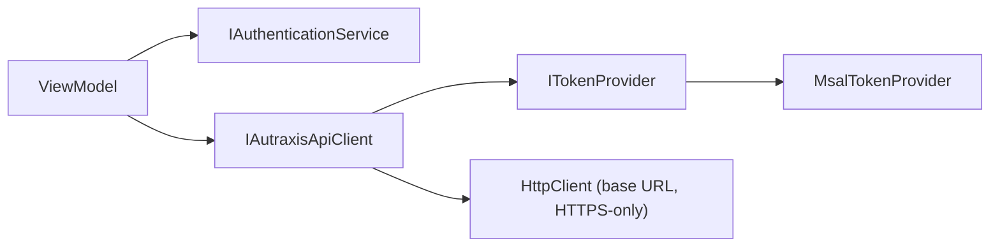

- **Base URL configuration**: one `Api:BaseUrl`-shaped configuration value per
  environment (§26/§27) — never hardcoded, never mixed across environments.
- **HTTPS only**: the base URL is always `https://`; the client refuses to construct
  a plain-HTTP backend request in any non-local-development configuration (loopback
  Entra redirect traffic, §10, is a separate, purely-local concern and is not the same
  thing as the backend API base URL).
- **Bearer token attachment**: `IAutraxisApiClient` calls `ITokenProvider.
  GetAccessTokenAsync(scopes)` immediately before each request and sets
  `Authorization: Bearer <token>` — never a cached/reused token field held across
  calls at the API-client layer (renewal is `ITokenProvider`'s job, transparently, per
  request).
- **Timeout**: a bounded per-request timeout (a specific value is an implementation
  detail, not an architecture decision — no value is invented here) — a hung request
  must not hang the application indefinitely (§21's startup-timeout concern applies
  identically to any request).
- **Cancellation**: `CancellationToken` plumbed from the calling ViewModel/operation
  through to the underlying `HttpClient` call, so a user-cancelled operation (e.g.,
  closing the login screen, stopping a translation session) does not leave an orphaned
  in-flight request.
- **401 handling**: exactly the bounded one-renew-one-retry policy (§12) — implemented
  once, centrally, inside `IAutraxisApiClient`, never duplicated per call site.
- **403 handling**: never triggers token renewal (§12) — mapped directly to the
  relevant §30 error category and returned to the caller; the *caller* (a
  ViewModel) decides UX (§16), the API client only classifies.
- **Network failure / DNS failure / backend unavailable / timeout**: mapped to
  `network_unavailable`/`service_unavailable` (§30) — never retried automatically
  beyond whatever ordinary transient-network retry policy (see next point) the client
  independently applies; explicitly **not** conflated with the authentication-retry
  policy.
- **Malformed response**: treated as `service_unavailable`-class failure (a
  problem-details-shaped response the client cannot parse is itself indicative of a
  backend-side problem, not a client bug to silently swallow) — never crashes the
  ViewModel; surfaced as a generic error.
- **API versioning**: no versioning scheme exists in the current backend surface
  (confirmed by inspection, §2.1) — this phase does not introduce one; if the backend
  ever adds API versioning, the client's `Api:BaseUrl`/path construction would need a
  corresponding update at that time, not anticipated speculatively here.
- **Authentication retry vs. network retry — explicitly separated**: the 401-driven
  renew-and-retry-once policy (§12) is a distinct code path from any general
  transient-network retry a future implementation might add (e.g., a brief retry on a
  connection-reset for a `GET`) — the two must never be combined into one generic
  "retry on any failure" loop, and non-idempotent mutations (`POST
  /translation-sessions`, `POST /provider-access`, `POST /devices`) are **never**
  blindly retried by a generic network-retry policy at all; where retry-safety is
  needed for a `POST`, it is provided by the *endpoint's own* existing idempotency
  design (Phase 6.9's `clientSessionId`-keyed idempotent start, Phase 6.9's idempotent
  heartbeat/end) — never by the HTTP client layer re-issuing an otherwise-unsafe
  request speculatively.

## 21. Startup lifecycle

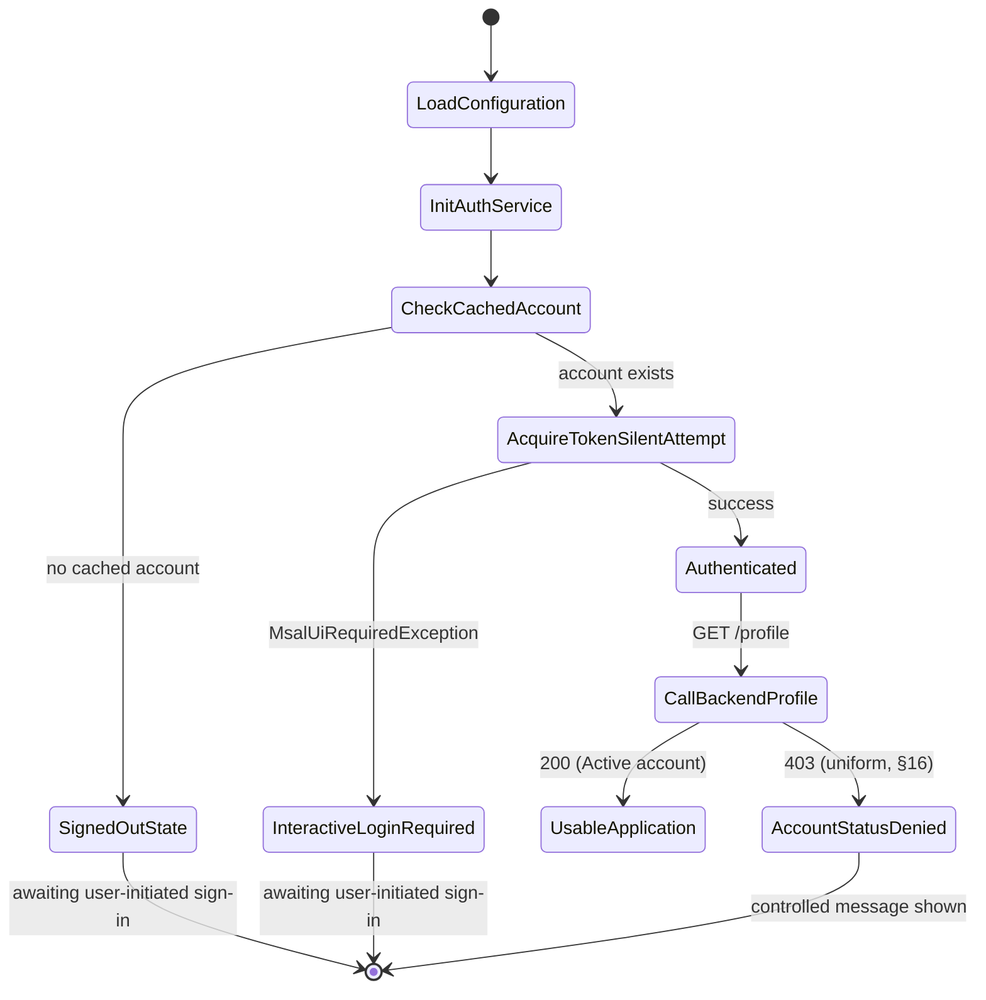

- **Configuration load**: `Authority`/`ClientId`/scope/`Api:BaseUrl` for the current
  build's environment (§26/§27) — validated at startup; a missing/malformed value
  fails closed with a clear internal diagnostic, never silently falling back to an
  unauthenticated-but-apparently-working state.
- **No indefinite hang**: `AcquireTokenSilent` is a bounded, typically-fast local/
  network operation with its own timeout behavior inside MSAL; the application does
  not additionally block its UI thread waiting on it — the startup state machine
  above transitions to `SignedOutState`/`InteractiveLoginRequired` promptly on any
  failure rather than spinning. The subsequent `GET /profile` call is subject to the
  same bounded per-request timeout as any other API call (§20) — a slow/unreachable
  backend at startup surfaces as a connectivity error, never an indefinite splash
  screen.
- **No auto-launched browser on cold start without user action**: on `MsalUiRequiredException`
  at startup, the application shows a login entry point (a button/screen) rather than
  immediately launching the system browser unprompted — avoiding a surprising,
  unexpected browser pop-up every time the app is opened after a token has expired.

## 22. Multi-instance behavior

| Scenario | Behavior / safeguard |
|---|---|
| One app instance | Baseline — no special handling needed. |
| Two simultaneous app instances (same Windows user) | Both share the same DPAPI-backed MSAL cache file (§11) — MSAL's own cache-file locking/serialization (documented, Microsoft-maintained behavior) prevents corruption from concurrent reads/writes; a token acquired by instance A becomes visible to instance B on its next cache read. No AUTRAXIS-specific coordination is designed beyond relying on this existing MSAL guarantee. |
| Multiple simultaneous *interactive* login attempts (e.g., both instances prompt at once) | **Recommended safeguard, this phase**: serialize interactive prompts at the `IAuthenticationService` layer *per instance* (§12) — this does not prevent two separate *processes* from each launching their own browser window if both reach that state simultaneously, which is a real but low-frequency and non-security-relevant UX rough edge (two browser tabs, both completable) rather than a correctness or security defect; not over-engineered further, since MSAL/Entra's own authorization-code-per-attempt model tolerates this safely (each attempt gets its own state/PKCE pair, per §12/§14 of the prior draft's PKCE section). |
| Multiple simultaneous token requests within one instance | Covered by §12's reliance on MSAL's own thread-safe silent-acquisition coalescing — no additional design needed. |
| Loopback redirect collisions (two instances both awaiting a callback) | MSAL's own loopback listener binds a fresh ephemeral port per attempt and retries on bind failure (documented MSAL behavior) — two concurrent interactive attempts on the same machine do not collide on a single fixed port, because no fixed port is used at all (§10's ephemeral-port design is precisely what avoids this). |
| Browser callback races | Each interactive attempt's `state` parameter (MSAL-managed, §12/prior draft §8) ensures a given browser callback is matched only to the attempt that generated it — no cross-attempt confusion. |
| Device registration races (two instances both registering as "new devices") | Already closed server-side by the existing Phase 6.7 row lock (§18) — no client-side coordination required. |
| Simultaneous backend sessions (two instances both authenticated as the same account) | Not restricted by this design — Phase 6.9's own translation-session model (unchanged) already handles concurrent session admission against the account-level usage limit (its own real-PostgreSQL-proven row lock); this phase introduces no new restriction on how many app instances may be simultaneously authenticated, deferring entirely to Phase 6.9's existing session/usage semantics for what those instances are actually allowed to *do* concurrently. |

**Recommendation**: do not over-engineer beyond what MSAL/Entra and the existing
backend (Phase 6.7/6.9) already correctly provide — the one genuine addition this
phase makes is per-instance interactive-prompt serialization (a small, local UX
safeguard), not a new distributed-coordination mechanism.

## 23. Security threat model

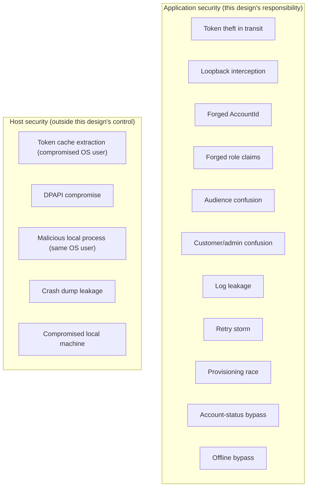

| # | Threat | Attack surface | Mitigation | Residual risk |
|---|---|---|---|---|
| 1 | Token theft (in transit) | Network path between client and Entra/backend | TLS everywhere (§29); MSAL uses HTTPS exclusively for token exchange | TLS-downgrade/MITM risk is addressed by TLS certificate validation itself (threat 29), not by this layer additionally |
| 2 | Refresh-token theft | Local cache file | DPAPI encryption (§11), user-scoped | Compromised same-OS-user process — host-security boundary (below) |
| 3 | Access-token theft | In-memory during a live request, or briefly in the MSAL cache | Short Entra-controlled lifetime; never logged (§25); never persisted outside MSAL's own cache | Live-process memory inspection by a sufficiently privileged local process — host-security boundary |
| 4 | Token cache extraction | The DPAPI-protected cache file itself | DPAPI ties decryption to the originating Windows user's own key material — a copied file is not decryptable elsewhere | A compromised process running AS that same Windows user can access what that user can access — inherent OS trust boundary, not an application-layer gap |
| 5 | DPAPI compromise | Windows OS-level cryptographic subsystem | Out of this application's control — DPAPI is the OS's own guarantee | If Windows/DPAPI itself is compromised, no application-layer mitigation compensates; explicitly a host-security, not application-security, concern |
| 6 | Loopback redirect interception | Local ephemeral-port HTTP listener | PKCE (the actual defense, §prior-draft-§8); listener alive only for one attempt's duration; no persistent service | A local process racing to bind the exact same ephemeral port first — low-probability, MSAL retries port selection |
| 7 | Custom URI scheme hijacking | N/A — this design does not use a custom scheme (§10) | Loopback chosen specifically to avoid this threat class | None — threat class not applicable to the recommended design |
| 8 | Malicious local process (same Windows user) | Shared OS-user trust boundary | Minimized exposure (short-lived tokens, memory-only provider credentials, §19); not eliminable | Inherent host-security limit — explicitly not claimed to be solved (§40 does not require the impossible) |
| 9 | Browser session hijacking | The system browser's own session/cookie state during login | Outside this application's control surface — mitigated by using the system browser (benefiting from its own security model, password manager, and any OS-level browser hardening) rather than an embedded WebView | Browser-level compromise is a host/browser-security concern, not an AUTRAXIS-client-layer one |
| 10 | Replay of access tokens | Bearer-token model generally | Short lifetime (Entra-controlled) bounds the replay window | Inherent to any bearer-token architecture; not specific to this design |
| 11 | Forged `AccountId` | Any request the client constructs | Structurally impossible — no endpoint in scope accepts an `AccountId` parameter (§2.1, confirmed unchanged) | None identified absent a backend regression, which is outside this phase's scope to introduce |
| 12 | Forged role claims | JWT claims | Structurally impossible — `Account.Role` is the sole source, never a claim (§14, proven by existing tests) | None beyond Phase 6.4's already-assessed residual risk (signing-key compromise) |
| 13 | Forged email claims | JWT claims | Identity is keyed on `(Provider, ExternalSubjectId)`, never email (§2.1, unchanged) | A support/UX confusion ("which account is mine") at most — not a security bypass |
| 14 | Audience confusion (ID token or admin token used as customer bearer token) | Client-side token selection logic | §13's hard rule (access token only); backend's existing, unchanged audience validation | Requires correct ongoing Entra-tenant/scope configuration — a config-drift risk, not a code flaw |
| 15 | Issuer confusion (dev/staging token against production) | Cross-environment token use | Per-environment tenant/registration separation (§26/§27) | Config-drift risk, not a design flaw |
| 16 | Customer/admin token confusion | §14's boundary | Separate schemes/audiences/tenants (Phase 7.0, unchanged); this client never acquires an admin token | None beyond correct operational configuration |
| 17 | Stolen device identifier | Locally stored `Device.Id` (§18) | Not itself a credential — every device-scoped call still requires a valid Entra access token, independently re-verified server-side against `AccountId` | A stolen `Device.Id` alone authorizes nothing; only useful in combination with a stolen access token, which is already covered by threats 3/4 |
| 18 | Provider-token theft | Memory-only short-lived Azure credential (§19) | Never persisted, never logged; short Azure-controlled lifetime | Same live-process-memory limit as threat 3 |
| 19 | Provider-token replay | Reuse of a captured short-lived Azure credential | Bounded by Azure's own short expiry (Phase 6.8, unchanged) | Inherent to any bearer-credential model within its validity window |
| 20 | Log leakage | Application diagnostic logs | §25's explicit never-log list, enforced by design and (in a future implementation) by a dedicated test (§29) | Requires ongoing implementation/code-review discipline — a process control, not eliminable purely by architecture |
| 21 | Crash dump leakage | A Windows crash dump capturing in-memory token/credential material at the moment of a crash | Minimized by short lifetimes and by never holding tokens/provider credentials longer than one call's duration in application-level fields (re-fetched per use, §19/§12) | Not eliminable for any process handling live bearer material in memory — inherent limitation, explicitly not overclaimed |
| 22 | Configuration leakage | Client ID/Authority/scope values | Non-secret by design (§26/§40 principle 13) — leakage of these values is not a security event | None — these are not secrets |
| 23 | Source-control secret leakage | Repository commits | No client secret exists to leak (§40 principle 13); the pre-existing `AZURE_SPEECH_KEY` environment-variable pattern (§18/§2.2) is itself a **development-only** convention, never committed to source control as a value — flagged again here as the one item requiring active migration work, not a design gap in this document | Until §18's migration is executed, the *environment the developer/customer runs the app in* — not source control itself — is where the real exposure lives today |
| 24 | Authentication retry storm | 401-handling logic | Hard one-renew-one-retry bound (§12/§20) — no unbounded loop | None, provided the bound is actually implemented as designed (a direct, testable requirement, §29) |
| 25 | Account-provisioning race | Concurrent first logins | Entirely server-side, already proven (§2.1/§15, real-PostgreSQL test) | None identified — this is Phase 7.0's already-closed concern, unaffected by the client |
| 26 | Account-status bypass | Client-side caching of a stale "was Active" assumption | §16's explicit rule — every session-adjacent action re-verifies against a fresh backend response, never a cached status | None identified, provided the rule is followed in implementation (a testable requirement, §29) |
| 27 | Offline authorization bypass | Network-unavailable conditions | §24's explicit rule — no new session/credential is ever authorized from stale local data; already-issued provider credentials continue only per their own bounded Azure lifetime | None beyond the inherent, already-accepted bound of "an already-issued short-lived credential remains valid for its own remaining lifetime," which is by design, not a gap |
| 28 | MITM / network downgrade | Network path | HTTPS-only enforced at the API-client layer (§20); Entra/MSAL's own token-endpoint calls are HTTPS by protocol requirement | Requires correct TLS validation (threat 29) to actually prevent MITM — the two threats are linked |
| 29 | TLS certificate issues (invalid/expired/self-signed cert accepted) | `HttpClient`/MSAL's own TLS validation | Standard .NET/MSAL TLS certificate validation, left at framework defaults — this design does not disable or weaken certificate validation for any environment, including development (a development environment lacking valid TLS should use a valid local development certificate, never a disabled-validation code path that could accidentally ship to production) | Requires this default-validation behavior to actually never be weakened in implementation — a direct, reviewable requirement |
| 30 | Malicious or compromised local machine (general) | The entire local execution environment | Every mitigation above is a *minimization*, not an elimination, of exposure on a compromised host — consistent with the explicit instruction not to claim otherwise | Fundamental, unavoidable limit of any client-side application handling live credentials; explicitly named as a host-security concern distinct from application security throughout this document |

**Explicit distinction maintained throughout**: *application security* (this
document's actual scope — protocol choice, PKCE, scope minimization, cache
mechanism, logging discipline, retry bounds) is design work this phase owns and can
meaningfully improve; *host security* (OS/DPAPI integrity, local process isolation,
physical machine compromise) is a boundary this design correctly minimizes exposure
against but cannot eliminate, and this document does not claim otherwise anywhere
above.

## 24. Offline behavior

Restated as a hard, non-negotiable rule (unchanged from Phase 6.2B §12, Phase 7.0
§14/§19/§20, and the prior draft of this document): **offline/unreachable-backend
conditions must never become an authorization bypass.**

| Condition | Behavior |
|---|---|
| Backend unavailable | Surface `service_unavailable` (§30); no cached entitlement/status substitutes for a real response; no new translation session may start. |
| Entra unavailable | Surface a distinguishable "sign-in service unavailable" state (§12's network-failure handling) — do not force a doomed interactive prompt. |
| Expired access token, backend reachable | Silent renewal (§12) — transparent. |
| Valid cached authentication (Entra still recognizes the identity), backend unreachable | The client cannot make ANY authenticated call at all in this state — this is not a special "degraded but continues" mode; it is functionally identical to "backend unavailable" above, since every protected operation requires an actual round-trip. |
| Valid, already-issued short-lived provider credential (§19), temporary network loss to the AUTRAXIS backend specifically (but Azure itself still reachable) | The **already-in-progress** use of that credential against Azure may continue for its own remaining, Azure-defined lifetime — this is not a new authorization, it is the natural consequence of a credential already validly issued before the network loss. **What this does NOT permit**: renewing that credential (`POST /provider-access` requires the backend, which is unreachable), starting a *new* translation session (`POST /translation-sessions` requires the backend), or treating the credential's continued short-term usability as evidence the account/subscription/device is still authorized in any broader sense. |
| Session reconnect (network restored) | The client re-attempts `AcquireTokenSilent` and a fresh backend authorization check (§16/§21) before resuming any translation-session-adjacent action — never assumes the pre-outage authorization state still holds without re-verifying; Phase 6.9's own `clientSessionId`-based reconnect semantics (unchanged) govern whether a translation session specifically resumes or must restart. |

**Exact boundary of the one permitted continuity window**: an already-issued Azure
provider credential (§19) continuing to function for its own remaining lifetime during
a network blip to the *AUTRAXIS backend specifically* is the **only** offline
continuity this architecture provides, and it is bounded entirely by a value AUTRAXIS
does not control (Azure's own token lifetime) — never by an AUTRAXIS-side "grace mode"
flag, cached flag, or timer. No other action (new session, new credential, new device
registration, new provisioning) is ever authorized without a live, successful backend
round-trip.

## 25. Observability

Safe authentication diagnostics — categories, not content:

**Logs may contain**: a locally-generated correlation ID (per login attempt / per API
call, never derived from token content), the operation name (e.g. "silent-renewal",
"interactive-login", "GET /profile"), the target endpoint, the resulting HTTP status
code, a stable authentication-outcome category (§30), elapsed time, and a
non-sensitive error code/exception *type name* (e.g. `MsalUiRequiredException`, not
its message if that message could echo any part of a request).

**Logs must NEVER contain**: access token, refresh token, ID token, authorization
code, PKCE verifier, client secret (none exists, §40 principle 13), provider master
key, provider bearer credential (§19), cookies, password (never touches AUTRAXIS code
at all), MFA challenge/response details, or the raw `Authorization` header value in
any form.

**Suggested telemetry categories** (names only, no code): `auth_login_started`,
`auth_login_succeeded`, `auth_login_cancelled`, `auth_token_refresh_succeeded`,
`auth_token_refresh_failed`, `auth_api_401`, `auth_interactive_required`,
`auth_logout`, `auth_account_status_denied` (generic — never a specific status value,
per §16), `auth_provisioning_denied` (generic — never a specific gate reason, per
§15).

**Crash dumps and diagnostic tooling** (§23 threat 21): a future crash-reporting
integration, if added, must be configured to scrub anything token-shaped (a
three-segment base64url string, an `Authorization:` header line) before transmission
— a requirement to carry into that future addition, not something this phase
implements (no crash-reporting SDK exists in the repository today, confirmed by
inspection).

## 26. Configuration

```
Identity:Customer:
    Authority     — <customer-tenant-authority-url>      (not a secret)
    ClientId      — <customer-wpf-client-id>              (not a secret)
    Audience      — <customer-api-app-id>                 (not a secret — matches backend's Identity:Audience)
    Scope         — <customer-api-scope>                  (not a secret)
    RedirectUri   — loopback (§10) — typically no explicit value needed
                    beyond MSAL's own default loopback configuration

Identity:Admin:
    (Phase 7.0, UNCHANGED — this client never reads or uses this section)

Api:
    BaseUrl       — <environment-specific AUTRAXIS API base URL>  (not a secret)
```

**Public (non-secret) configuration**: `Authority`, `ClientId`, `Audience`, `Scope`,
`Api:BaseUrl` — all may be committed per environment, exactly mirroring the existing,
proven pattern already used for the backend's own `Identity:Authority`/
`Identity:Audience` (empty/placeholder in a shared committed file, real values
supplied per environment via build configuration or environment variables at
publish/deployment time).

**Secret configuration**: **none exists for this client** — a public desktop client
has no client secret to protect, by design (§40 principle 13); this is not an
oversight to fill in later, it is the correct, final state.

**Where each value lives**:
- **`appsettings`-equivalent for the WPF app**: `Authority`/`ClientId`/`Audience`/
  `Scope`/`Api:BaseUrl` — safe to commit per-environment file (mirrors the backend's
  own `appsettings.{Environment}.json` pattern).
- **Environment variables**: acceptable as a local-development override mechanism
  (consistent with the *existing* `AZURE_SPEECH_KEY` convention, §2.2/§18, though that
  specific value is itself being retired) — not required for these non-secret values.
- **Build configuration**: which environment's values a given build targets is a
  build-time/publish-time decision — a specific mechanism (compile-time constant vs.
  a settings file selected by build configuration) is an implementation detail for a
  future implementation phase, not fixed here.
- **Deployment configuration**: N/A in the server sense — a desktop client has no
  deployment-time secret-injection step, because there is no secret to inject.
- **Secret store**: nothing belongs here for this client.

## 27. Environment strategy

| | Development | Test/CI | Production |
|---|---|---|---|
| Entra tenant | Separate dev tenant | Uses mocked/deterministic test tokens (below) — does not require a real tenant for ordinary CI | Separate production tenant |
| Redirect URI | Loopback (identical mechanism, §10) | N/A — CI does not launch a real browser (below) | Loopback |
| `Api:BaseUrl` | Dev backend instance | A test/mock backend instance, or the real backend's test double via `WebApplicationFactory`-equivalent patterns already proven server-side | Production backend instance |
| Logging | May be more verbose (still subject to §25's never-log rules, unconditionally — verbosity level never relaxes the secret-redaction rule) | Verbose, ephemeral (CI logs) | Production-appropriate verbosity, still fully subject to §25 |
| Provider configuration | The *backend's* own dev-mode provider configuration (Phase 6.8, unchanged) — **not** the client's current direct `AZURE_SPEECH_KEY` usage, which is explicitly being retired (§18/§36) | N/A — provider calls are mocked/not exercised in ordinary unit/integration tests, mirroring the existing backend test pattern (`UnconfiguredProvider_ReportsUnsupportedProvider_NeverFabricatesCredential`) | Backend-only provider configuration (Phase 6.8, unchanged) |
| Token cache | Real DPAPI cache on the developer's own machine | **Not exercised for ordinary unit tests** — `ITokenProvider` is faked (§29); a small number of client-side integration tests may exercise a real, throwaway DPAPI cache location if that proves valuable, but this is not required for CI to pass | Real DPAPI cache on the customer's machine |
| Test identities | A developer may use a real personal dev-tenant test account interactively, or rely entirely on faked `ITokenProvider`/mocked backend responses | **No real customer password or live Entra credential is required or used** — see §29 | N/A (production has real customers, not test identities) |
| Secret handling | No secrets exist for this client (§26) — nothing to handle beyond the (retiring) dev-only provider key, which is itself never a client-authentication secret | Same — CI needs no authentication secret for this client | Same |

**CI must not require a real customer password** — confirmed achievable and designed
for: every unit/integration test category in §29 is built around a faked
`ITokenProvider` and/or the backend's own existing `WebApplicationFactory` +
deterministic-HMAC-signing-key test pattern (already proven across
`AuthenticationIntegrationTests`, `ProfileEndpointTests`, `AdminCustomerBoundaryTests`)
— none of which involve a real Entra tenant, a real browser, or a real password,
today or in this design.

**Real Entra E2E** is explicitly a separate, controlled, non-CI test tier — see §29.

## 28. Test strategy

### Unit tests
- Token-acquisition abstraction (`ITokenProvider`): silent-then-interactive fallback
  ordering; correct scope/authority passed through; cancellation propagation.
- Token expiration: a fake provider simulating an expired-then-renewed token sequence.
- Cancellation: a fake interactive flow that honors a `CancellationToken`.
- Concurrent token requests: multiple simultaneous `GetAccessTokenAsync` calls against
  a fake provider resolve consistently (no duplicate interactive prompt triggered by
  the application layer's own serialization guard, §12/§22).
- Logout: `IAuthenticationService.SignOutAsync` invokes the correct
  targeted-removal call and clears local application state, verified against a fake
  cache/provider — no real MSAL/DPAPI dependency.
- Cache corruption: a fake `ITokenCacheStore`/`ITokenProvider` simulating a corrupted
  cache resolves to "no cached account" rather than throwing an unhandled exception.
- 401 handling / one-time retry / infinite-loop prevention: a fake `HttpMessageHandler`
  scripted to return `401 → 200` (verify exactly one retry, succeeds) and
  `401 → 401` (verify exactly one retry attempt total, then a controlled failure —
  never a third attempt), mirroring the exact pattern already proven server-side in
  `TranslationSessionServiceTests`/`ProfileEndpointTests`'s own test-double
  discipline.

### API integration tests (reusing/extending the EXISTING backend test suite —
new client-facing scenarios only where not already covered)
- Valid customer token → 200 (already covered: `ProfileEndpointTests`,
  `AuthenticationIntegrationTests` — confirmed existing, unchanged).
- Invalid issuer / invalid audience → 401 (already covered:
  `AuthenticationIntegrationTests.InvalidIssuer_Rejected401`/`InvalidAudience_Rejected401`
  — confirmed existing, unchanged).
- Expired token → 401 (already covered:
  `AuthenticationIntegrationTests.ExpiredToken_Rejected401` — confirmed existing).
- Forged role → no elevation (already covered:
  `ClientSuppliedRoleClaimInsideJwt_CannotEscalatePrivileges`,
  `ProfileEndpointTests.ForgedRoleClaim_DuringProvisioning_NeverElevatesRole` —
  confirmed existing).
- Forged `AccountId` → no effect (already covered:
  `ProfileEndpointTests.ForgedAccountIdInBody_HasNoEffect_...` — confirmed existing).
- Suspended/disabled/closed/Pending account → uniform denial (already covered:
  `ProfileEndpointTests.SuspendedAccount_DeniedAtProfileEndpoint`/
  `DisabledAccount_.../ClosedAccount_.../PendingAccount_...` — confirmed existing).
- Active account → normal success (already covered, throughout).
- Profile isolation (already covered:
  `ProfileEndpointTests.CrossAccount_CannotReadAnotherAccountsProfile`).
- Device isolation (already covered:
  `DeviceCustomerEndpointsTests`/Phase 6.7 tests).
- Provider-access authorization (already covered: `ProviderAccessEndpointTests`).
- **Net new for Phase 7.1's implementation**: none required at the backend level —
  every scenario above is already exercised against the exact request/response
  shapes the client will use. The client's own future integration tests (below)
  exercise the *client-side* consumption of these same, unchanged backend behaviors.

### Authentication boundary tests (already implemented and passing, Phase 7.0 —
confirmed unchanged, reused as the specification for client-side assumptions)
- `AdminCustomerBoundaryTests.CustomerToken_CannotAuthenticateAsAdmin`
- `AdminCustomerBoundaryTests.AdminToken_CannotAuthenticateAsCustomer`
- `AdminCustomerBoundaryTests.ForgedRoleClaim_OnCustomerToken_CannotElevateToAdminBoundary`
- `AdminCustomerBoundaryTests.ForgedAudience_CannotCrossBoundary`
- `AdminCustomerBoundaryTests.WrongIssuer_CannotCrossBoundary`

### JIT tests (already implemented and passing, Phase 7.0 — confirmed unchanged)
- `AccountProvisioningServiceTests.VerifiedIdentity_ProvisionsSuccessfully`
- `AccountProvisioningServiceTests.UnverifiedIdentity_DeniedWhenVerificationRequired`
- `AccountProvisioningServiceTests.ProvisioningDisabled_AlwaysDenied`
- `AccountProvisioningServiceTests.RateLimitExceeded_DeniesFurtherAttemptsForTheSameIdentity`
- `AccountProvisioningServiceTests.RepeatedFirstLogin_SameIdentity_ResolvesSameAccountViaMiddlewareFlow`
- `EfPostgresPersistenceTests.AccountProvisioning_ExceptionInsideTransaction_RollsBackAccountAndProfileAndAudit`
- `EfPostgresPersistenceTests.ConcurrentFirstLogin_SameIdentity_CreatesExactlyOneAccount_RealPostgres`

### Windows client tests (net new — future implementation, per §35 sequence)
Where practical (per the master prompt's own qualifier), test: the MSAL cache
integration against a real, throwaway DPAPI-protected file location; startup
state-machine transitions (§21) against a fake `ITokenProvider`; silent login;
interactive login (necessarily limited to what can be tested without a real browser —
i.e., the *outcome-handling* logic around `AcquireTokenInteractive`, not the browser
interaction itself, per the `ITokenProvider` seam's own design intent); logout; a
faked API call exercising the 401-renewal path end-to-end through the real
`IAutraxisApiClient` implementation with a fake `HttpMessageHandler`; network-failure
simulation; and cancellation of an in-progress login.

### Real Entra E2E
A dedicated, non-production Entra External ID tenant with a real customer application
registration, exercising: sign-up → sign-in → token acquisition → a real authenticated
call to a non-production AUTRAXIS API instance → account provisioning → profile
retrieval. **Not required for, and never run as part of, ordinary CI** — this suite
requires live network access and a maintained test tenant. **Recommended cadence**:
pre-release (before any production deployment) and/or nightly against a
long-lived staging environment — a specific choice between the two (or both) is an
**operational decision** (§34), not fixed here. No live customer credentials are
fabricated or embedded anywhere in this document or in ordinary test code; where the
tenant supports a dedicated, non-human test-user credential mechanism for automated
E2E, that credential lives exclusively in the CI/test infrastructure's own secret
store, never in source control.

## 29. Test secrets

Explicit, unambiguous restatement:
- No secrets are committed, anywhere, at any point.
- No real access tokens are committed.
- No refresh tokens are committed.
- No provider keys are committed.
- **No production (or any) client secret exists in the WPF app** — there is nothing of
  this kind to accidentally commit, by architectural design (§26/§40 principle 13),
  not merely by discipline.
- Test credentials for the Real Entra E2E tier (§28), if and when that tier is
  implemented, come exclusively from approved, access-controlled CI/test
  infrastructure secret storage — never from a developer's local environment file
  committed by accident, and never hardcoded in a test source file.

## 30. Error contract

Reusing, not replacing, the backend's existing response shapes (`{ "status": "..." }`,
confirmed present across every endpoint inspected in §2.1) — the client maps them to
its own stable internal categories rather than pattern-matching arbitrary text:

| Client-internal category | Triggered by |
|---|---|
| `authentication_required` | No cached account, or a silent-renewal failure with no automatic recovery (`MsalUiRequiredException` with no further fallback attempted) |
| `authentication_cancelled` | User cancelled the interactive browser flow |
| `authentication_unavailable` | Entra itself unreachable (network/DNS/TLS failure reaching the tenant) |
| `account_not_found` | Backend `403 account_not_found` (uniform denial, §15/§16) |
| `account_not_usable` | Backend `403` for a non-`Active` account status (§16) — a single generic category; the client does not expose `account_pending`/`account_suspended`/`account_disabled`/`account_closed` as separately *displayed* messages, because the backend does not distinguish them in its response today. These four names are reserved in this table as forward-compatible internal values only, should a future, separate, explicit backend change ever make them distinguishable — not because the current backend response supports displaying them differently. |
| `device_not_authorized` | Backend `403 device_not_authorized` (Phase 6.7, unchanged — already distinguishable, not an anti-enumeration-sensitive account-identity fact) |
| `entitlement_denied` / `subscription_not_entitled` | Backend `403 entitlement_denied` (Phase 6.6/6.8, unchanged) |
| `provider_access_denied` | Backend `400 unsupported_provider` or `403` from `/provider-access` (Phase 6.8, unchanged) |
| `network_unavailable` | DNS/TLS/connection failure reaching the AUTRAXIS API |
| `service_unavailable` | Backend reachable but returning 5xx / malformed response |
| `token_refresh_failed` | Silent renewal failed for a reason other than requiring interactive login (e.g., a transient Entra-side error distinct from `MsalUiRequiredException`) |

This reuses Phase 7.0's existing problem-code convention exactly (a short `status`
string, already present in every response shape inspected) rather than inventing an
incompatible new error model — satisfying the explicit instruction to reuse the
existing contract if one exists, which it does.

## 31. Device/session relationship

```
Identity (Entra, this phase) → Account (Phase 7.0) → Device (Phase 6.7) → Provider Access (Phase 6.8) → Translation Session (Phase 6.9)
```

| Event | Effect (all downstream behavior unchanged from its owning frozen phase) |
|---|---|
| User logs in on a new machine | A new `Device` registration (`POST /devices`, Phase 6.7) — subject to the existing pooled `MaxActiveDevices` limit; no special "new machine" detection beyond the normal registration flow. |
| User logs out (this phase, §20) | Local token cache cleared for that account; **device is NOT revoked** (§20's explicit rule, matching this phase's own instruction: "do not revoke a device merely because the user logs out"); **subscription is NOT mutated**. |
| User revokes a device (`POST /devices/{id}/revoke`, Phase 6.7, unchanged) | That device can no longer register/heartbeat/authorize provider access or translation sessions on subsequent calls — Phase 6.7's own existing, unchanged enforcement; the *authentication* layer (this phase) is unaffected — the user's Entra identity and cached tokens remain valid; only that specific device's authorization is revoked. |
| Device is no longer entitled (e.g., pooled limit reduced by a plan change) | Phase 6.6/6.7's own existing entitlement re-evaluation (unchanged) — surfaces as `device_not_authorized`/`entitlement_denied` on the next relevant call; not a Phase 7.1 concern beyond correctly surfacing the existing error category (§30). |
| Account is suspended/disabled/closed | Every downstream call (device, provider-access, translation-session) is blocked at `AccountResolutionMiddleware`'s existing gate (§16) — before any device/provider/session-specific code runs; the authentication layer's job is only to surface the resulting uniform `403` correctly (§16). |
| Authentication expires during an active translation session | Handled by the shared 401-renewal policy (§12/§19's session-specific note) — a heartbeat or end call that hits a 401 silently renews and retries once, safely, because those operations are already idempotent server-side (Phase 6.9, unchanged); this phase adds no new session-termination trigger tied to token expiry itself. |
| Provider access expires during an active translation session | Handled entirely by §19's renewal scheduling — the translation session itself (Phase 6.9) is not directly coupled to the provider credential's lifetime; a lapsed, unrenewed provider credential would cause the *provider call* (to Azure) to fail, which is a Core/provider-layer concern already existing today, not newly introduced or changed by this phase. |
| Backend becomes unavailable during an active translation session | §24's offline rule — the session continues only as long as no further backend round-trip is required (an already-issued provider credential's own remaining lifetime), and Phase 6.9's own lease/heartbeat/lazy-expiry mechanism (unchanged) governs eventual server-side accounting once connectivity is restored or the lease expires; this phase does not alter that mechanism. |

**No redesign of Phase 6.9's session lifecycle occurs anywhere in this table** — every
row describes how the *authentication* layer's own state changes interact with, and
are correctly absorbed by, session/device/provider-access mechanisms that are already
complete and unchanged.

## 32. Mobile portability

Phase 7.1 is Windows-first; no mobile code is designed or implemented here.

**Platform-specific pieces** (Windows, this phase): MSAL.NET (the .NET-specific
library), the system browser + loopback-listener mechanism as MSAL.NET implements it,
and DPAPI-backed secure storage.

**Platform-neutral concepts** (apply identically to a future Android/iOS client):
OAuth 2.0 Authorization Code Flow + PKCE, the single customer-facing API
audience/scope (§13), and backend authorization (`AccountResolutionMiddleware` →
`Account`/`Role`/`Status` → device/provider-access/translation-session, entirely
unchanged and confirmed platform-neutral by this phase's own inspection, §2.1).

**Future mobile shape** (principles only, not designed further): Android — system
browser (Chrome Custom Tabs) + Authorization Code + PKCE via MSAL for Android or an
equivalent AppAuth-Android-based OIDC client + Android Keystore-backed secure storage.
iOS — system browser (`ASWebAuthenticationSession`) + Authorization Code + PKCE via
MSAL for iOS + Apple Keychain-backed secure storage. Same shape as Windows throughout,
differing only in which OS-native secure-storage primitive backs the cache.

**No Windows-specific assumption is forced into any backend API** — confirmed by
inspection (§2.1): every endpoint this design calls already derives its authorization
context solely from the bearer token and server-side state, with zero
platform-conditional logic anywhere in the backend. **No separate backend
authorization model is ever created for mobile** — one customer audience, one
account-resolution flow, serving every platform identically, both today and in this
phase's design for Windows specifically.

## 33. Architecture decision matrix

| # | Decision | Options | Recommendation | Rationale | Security implications | Operational implications | Migration implications |
|---|---|---|---|---|---|---|---|
| 1 | Authorization flow | Auth Code + PKCE / Implicit / Device Code / Resource-Owner-Password | **Authorization Code + PKCE** | The only flow suitable for a public desktop client that must not handle raw credentials directly and must resist code interception; Implicit is deprecated/discouraged for exactly this token-exposure reason, Device Code has poor desktop UX, ROPC would require the app to handle passwords directly (categorically forbidden, §40 principle 4/13-adjacent) | Strongest of the four for this client type | Standard, MSAL-native, zero custom protocol code | None — this is the flow Phase 7.0 already approved conceptually |
| 2 | Browser | System browser / embedded WebView | **System browser** | Benefits from the OS browser's own security model, saved sessions, and avoids an embedded control that could, in principle, observe credential entry; already mandated by Phase 7.0 §14 | Materially better — avoids embedded-WebView credential-observation risk | Slightly less visually integrated UX (a separate window briefly appears) — an accepted, standard trade-off | None |
| 3 | Redirect mechanism | Loopback / custom scheme / broker-WAM | **Loopback** (§10) | No registry/manifest dependency, works identically unpackaged or under future MSIX, PKCE (not the redirect mechanism) is the actual interception defense | Lower interception surface than custom scheme for an unpackaged exe | Zero install/registration step | Compatible with a future MSIX/WAM upgrade without redesign |
| 4 | Token cache | MSAL's own cache (DPAPI-backed extension) / custom token store | **MSAL's own cache** | Microsoft-maintained, purpose-built, avoids inventing cryptography (§40 principle 15) | Strongest available without custom crypto | Zero custom cache-format maintenance burden | None — this is the standard MSAL.NET desktop pattern |
| 5 | Windows secure-storage primitive | DPAPI / Credential Manager (direct) | **DPAPI**, via MSAL's own extension | Native MSAL integration exists for DPAPI specifically; Credential Manager would require extra adapter code for no corresponding security gain here | Equivalent security profile to Credential Manager for this use case | Simpler integration | None |
| 6 | Renewal strategy | Silent-first with interactive fallback / always-interactive | **Silent-first, interactive fallback only on failure** | Minimizes user-visible friction; interactive-only would be a poor UX regression with no security benefit | No security difference between the two — UX-only distinction | Silent-first is the standard, expected pattern | None |
| 7 | API audience count | One customer audience / multiple (e.g. per-endpoint) audiences | **One customer audience** | No requirement exists for finer-grained audiences; the backend's existing `Identity:Audience` is already singular and unchanged | Simpler validation surface, fewer places to misconfigure | Simpler Entra-tenant configuration | None — matches existing, unchanged backend design |
| 8 | Customer/admin boundary | Shared scheme with role claims / separate schemes+audiences+tenants | **Separate schemes+audiences+tenants** (already Phase 7.0's decision) | Structurally prevents cross-boundary token use, rather than relying on claim-based convention alone | Materially stronger — a shared-scheme model would rely on role claims never being forgeable, which is a weaker structural guarantee | Two tenants/registrations to operate instead of one | None — already implemented, Phase 7.1 reuses as-is |
| 9 | Account creation | Client-initiated creation endpoint / server-side gated JIT | **Server-side gated JIT** (already Phase 7.0's decision) | Client-initiated creation would require the client to be trusted with a decision (eligibility) that must remain server-authoritative | A client-callable "create account" endpoint would be a meaningfully larger attack/abuse surface than none at all | No new endpoint to operate or secure | None — already implemented |
| 10 | Device identity | Local hardware fingerprint / server-issued logical ID | **Server-issued logical ID** (already Phase 6.7's decision) | Hardware fingerprinting is brittle (false revocations across reinstalls/hardware changes) and a weaker security boundary than server-issued, server-revocable credentials (Phase 6.2B §6's own rationale) | Server-issued IDs are revocable instantly and reliably; fingerprints are not a security boundary at all on their own | No fingerprinting infrastructure to build/maintain | None — already implemented, reused as-is |
| 11 | Provider credential location | Master key in client / backend-mediated short-lived credential | **Backend-mediated short-lived credential** (already Phase 6.8's decision) | A master key in the client is permanently exposed on every customer machine; a short-lived, backend-issued credential bounds exposure to minutes and remains revocable at the AUTRAXIS-authorization layer even though the issued Azure token itself cannot be recalled early | Categorically stronger — this is the entire reason Phase 6.8 exists | No operational change beyond what Phase 6.8 already requires | **The current client does NOT yet follow this decision (§18/§2.2) — migrating it is the single most consequential migration this phase's design enables and should prioritize** |
| 12 | Offline authorization | Cached-entitlement bypass / online-authority-only with bounded credential continuity | **Online-authority-only**, with the one bounded exception already described in §24 | Any broader offline bypass directly contradicts the explicit, repeated, non-negotiable architectural rule carried from Phase 6.2B through Phase 7.0 | An offline bypass would be a severe authorization-integrity regression | None — this is the status quo, not a new operational burden | None |
| 13 | Custom AUTRAXIS JWT | Introduce a second, AUTRAXIS-issued application token / rely solely on the Entra-issued access token | **Rely solely on the Entra-issued access token** — do NOT introduce a custom JWT | Every protected backend call already re-derives `AccountId`/`Role`/`Status` fresh from the Entra token on every request (stateless, no server-side session to invalidate); a second AUTRAXIS-issued token would introduce a *second* revocation/rotation/signing-key-management problem for no corresponding benefit, since Entra's own refresh-token rotation and revocation already provide standard, Microsoft-supported session control. A custom JWT would also reintroduce exactly the "who validates this, with what keys, rotated how" surface that adopting Entra was meant to eliminate. | A second token type is a second thing to get wrong (weak signing, missed rotation, inconsistent validation) — strictly more attack surface for zero added capability | Would require building and operating AUTRAXIS's own token-issuance/signing-key infrastructure — a substantial, ongoing operational burden with no offsetting benefit | Would be a significant, unjustified redesign of an already-working, already-tested authentication chain — explicitly rejected |

## 34. Open decisions (architecture vs. product vs. operational)

**Architecture decisions** (resolved by this document): flow (Auth Code + PKCE),
browser (system), redirect mechanism (loopback), token cache (MSAL/DPAPI), renewal
strategy (silent-first), audience count (one), customer/admin boundary (separate,
reused from Phase 7.0), account creation (server-gated JIT, reused), device identity
(server-issued, reused), provider credential handling (backend-mediated, reused), no
custom JWT.

**Product-owner decisions** (explicitly open — not resolved here):

| # | Decision | Options | Owner |
|---|---|---|---|
| 1 | Exact customer tenant configuration (real tenant name/domain, branding) | Specific values | Product/Design |
| 2 | Exact redirect URI value / port convention if Entra requires a specific registered pattern beyond "any loopback port" | Specific Entra-portal configuration choice | Engineering (operational, once a real tenant exists) — flagged here since it may require a product-visible decision if a fixed port is ultimately required by a future MSAL/Entra policy change |
| 3 | Production domain(s) for the backend API | Specific domain(s) | Product/Ops |
| 4 | Exact API scope naming (e.g. `access_as_customer` vs. another name) | Specific string | Engineering, but naming conventions sometimes carry product visibility (e.g. if ever surfaced in a consent screen) |
| 5 | Account-onboarding UX (what the first-run experience looks like, beyond the architectural fact that it triggers gated JIT provisioning) | Specific UX flow/copy | Product/Design |
| 6 | Logout UX (button placement, confirmation dialog, messaging) — the *semantics* are resolved (§20, auth-only, no device/subscription mutation) but the *UX* is not | Specific UX | Product/Design |
| 7 | Session-timeout UX (whether/how the app communicates an upcoming or just-occurred silent renewal to the user, if at all) | Silent/invisible (recommended default) vs. a visible indicator | Product — recommend invisible/silent as the default absent a stated reason otherwise |
| 8 | Privacy/retention policy for local authentication diagnostic logs (§25) — how long correlation-ID-keyed logs are kept on the client machine | Specific retention window | Product/Ops |
| 9 | Commercial subscription messaging shown alongside account-status denials (§16) — e.g., should an `account_not_usable` message ever link to a support/upgrade flow | Specific copy/flow | Product |
| 10 | Real Entra E2E cadence (§28) — nightly vs. pre-release vs. both | Specific schedule | Engineering/Ops |
| 11 | Whether the app ever offers an explicit "switch account" affordance vs. sign-out-then-sign-in only (§22's multi-instance note extends to this UX question) | Explicit switcher / sign-out-then-sign-in only | Product |
| 12 | **Priority/timeline for retiring `MainViewModel`'s direct `AZURE_SPEECH_KEY`/`AzureSpeechTranslationProvider` usage** (§18/§33 decision 11) | Immediate co-requisite to this authentication work / deferred | **Strongly recommended: treat as a mandatory companion workstream, not a deferrable follow-up** — this is a rationale restated from architecture, but the *scheduling* decision belongs to the product owner | Product owner (to sequence) + Engineering (to execute) |

**Operational decisions** (not product, not pure architecture): Entra tenant
provisioning steps and portal configuration sequencing; CI pipeline wiring for the
test tiers in §28; crash-reporting/telemetry vendor selection if one is ever added
(§25); code-signing certificate acquisition/process for the shipped executable.

No item above is silently resolved by this document — every one is either marked
architecture-resolved with rationale, or explicitly left open with its owner named.

## 35. Implementation sequence — design only (not started)

1. Authentication configuration abstraction (`Identity:Customer:*`/`Api:BaseUrl`
   loading and validation, §26).
2. MSAL.NET customer authentication service (`MsalTokenProvider`, `IPublicClientApplication`
   construction, §9).
3. Secure token cache (`MsalCacheHelper`/DPAPI wiring, §11).
4. Authenticated API client (`IAutraxisApiClient`, base URL, bearer attachment,
   bounded 401 policy, §20).
5. WPF authentication state (the `IAuthenticationService` seam, event/state
   surfacing to ViewModels, §9/§31 of the prior draft's testability section).
6. Login/logout UI flow (§21 startup wiring, §20 logout wiring).
7. Profile integration (`GET`/`PUT /profile` consumption, §17).
8. Device integration (`POST /devices` wiring, secure local storage of the returned
   `Device.Id`, §18).
9. Provider-access integration (`POST /provider-access` wiring and renewal
   scheduling, §19) **together with** removal of the current direct
   `AzureSpeechTranslationProvider`/`AZURE_SPEECH_KEY` code path in `MainViewModel`
   (§18/§33 decision 11/§34 item 12) — recommended as one combined step, not two
   independently schedulable ones, per this document's final recommendation.
10. Translation-session integration (`POST /translation-sessions*` wiring, §31).
11. Automated tests (§28's unit/integration/security categories).
12. Controlled real-Entra E2E (§28's dedicated tier).
13. CI verification (wiring the above into the existing CI pipeline, alongside the
    already-passing backend/Core suites — no existing test is weakened or removed).
14. Security review (a focused pass against this document's own §23 threat model,
    performed against the actual implementation).

None of these steps are implemented in this phase.

## 36. Migration / backward compatibility

- **Existing development workflows**: unaffected until step 9 of §35 is executed —
  until then, a developer can continue running the app exactly as today (direct
  `AZURE_SPEECH_KEY` usage) while the new authentication code paths are built and
  tested independently alongside it, since nothing in steps 1–8 requires removing the
  current code path.
- **Existing automated backend tests**: entirely unaffected — this phase changes no
  backend file, confirmed by the design's own non-goals (§5) and by the fact that
  every backend behavior this design depends on is already implemented and already
  tested (§2.1/§28).
- **Existing WPF tests**: none exist today (§2.2) — this phase's design introduces the
  first ones, additively; nothing to break.
- **Existing local Azure provider testing**: the current direct-provider-key
  development flow can remain available **explicitly as a development-only fallback**,
  clearly isolated (e.g., gated behind a build configuration or an explicit
  "developer mode" flag that is never the default in a Release/production build) —
  ensuring it can never become the shipped production path, addressing the master
  prompt's own explicit requirement on this point.
- **No breakage of Phase 6.6–7.0**: confirmed throughout this document (§2.1, §5,
  §33) — every backend contract this design consumes is already stable, tested, and
  unmodified by this phase.

## 37. Production readiness checklist

**Identity**
- [ ] Production customer Entra External ID tenant configured, separate from
      Staging/Development and from the admin/workforce tenant.
- [ ] Customer public-client application registration created (no secret).
- [ ] API registration exposes the customer-facing scope; audience matches the
      backend's existing `Identity:Audience` for production.
- [ ] Redirect URI (loopback) verified against the real production tenant.
- [ ] Issuer/audience values confirmed correct and non-overlapping with
      Staging/Development/Admin (§26/§27).
- [ ] MFA policy decided and configured (open product decision, §34 item 1-adjacent
      restated from Phase 7.0 §26 item 4).
- [ ] Account-provisioning policy (`AccountProvisioningOptions`, Phase 7.0, unchanged)
      confirmed correctly configured for production (`RequireEmailVerified`,
      rate-limit values).

**Windows**
- [ ] MSAL.NET integrated and tested against the real production tenant.
- [ ] System-browser interactive login verified end-to-end.
- [ ] Secure DPAPI-backed token cache verified on a real Windows machine, including
      multi-user isolation (§22/§11) and corruption-recovery behavior.
- [ ] Logout verified (targeted account removal, §20).
- [ ] Token renewal (silent + interactive fallback) verified against a real expired
      token, not only mocked tests.
- [ ] `IAutraxisApiClient` bounded 401 policy verified against a real backend 401.
- [ ] Error handling verified to never surface raw MSAL/HTTP exception text to the
      end user (§30).

**Backend** (verify, do not modify)
- [ ] Customer scheme (`Identity:Authority`/`Identity:Audience`) confirmed correctly
      configured for production — unchanged from Phase 6.4/7.0.
- [ ] Admin scheme (`Identity:Admin:*`) confirmed correctly configured — unchanged
      from Phase 7.0; the customer client confirmed to never touch it.
- [ ] Audience/issuer validation confirmed unchanged and functioning (existing test
      suite green).
- [ ] `AccountId` authority confirmed server-side-only (existing test suite green).
- [ ] Role authority confirmed server-side-only (existing test suite green).
- [ ] Account-status enforcement confirmed functioning for all five states (existing
      test suite green).
- [ ] JIT provisioning confirmed functioning, including the real-PostgreSQL
      concurrency test (existing test suite green, Docker-backed in CI).

**Security**
- [ ] No secrets in the WPF client — confirmed by inspection/a dedicated future test
      (§18/§28's provider-secret-scan category).
- [ ] No tokens in any log, crash report, or diagnostic output (§25).
- [ ] No provider master keys in the client — **the pre-existing `AZURE_SPEECH_KEY`
      exposure resolved** (§18/§34 item 12) before this item can be checked.
- [ ] No custom JWT introduced (§33 decision 13) — confirmed by design, verify by
      code review at implementation time.
- [ ] No offline authorization bypass (§24) — verified by a dedicated future test.
- [ ] No client-side `AccountId` trust (§11/§17/§18, confirmed structurally — no such
      parameter exists anywhere the client calls).
- [ ] No client-side role trust (confirmed structurally, same reasoning).

**Testing**
- [ ] Unit tests (§28) passing.
- [ ] Integration tests (§28, reusing the existing backend suite) passing.
- [ ] Real-PostgreSQL tests (Phase 7.0, existing, unchanged) verified passing in CI.
- [ ] Authentication boundary tests (Phase 7.0, existing, unchanged) verified passing.
- [ ] JIT tests (Phase 7.0, existing, unchanged) verified passing.
- [ ] Windows client tests (§28, net new) passing.
- [ ] Real Entra E2E (§28) executed against a production-equivalent non-production
      tenant before go-live.

**Operations**
- [ ] Environment-specific configuration (§26/§27) verified correct per environment,
      with no cross-environment value leakage.
- [ ] No secret management gap — confirmed there is genuinely nothing secret to manage
      for this client (§26/§29), and that the retiring `AZURE_SPEECH_KEY` development
      convenience is fully removed from any path that could reach production.
- [ ] Logging/monitoring wired for the categories in §25.
- [ ] Incident-response process defined for a compromised client-side cache/token
      scenario (an operational decision, §34).
- [ ] Token-revocation/session-response process defined (i.e., what an operator does
      at the Entra-tenant level if a customer's session needs to be forcibly
      invalidated — an Entra-tenant-side capability, not a new AUTRAXIS-built
      mechanism).

## 38. Non-goals (explicit, exhaustive)

Phase 7.1 does **not** implement:
- Android client.
- iOS client.
- Billing provider integration (Paddle or otherwise).
- New subscription logic.
- New device-licensing rules.
- New provider gateway behavior (Phase 6.8 is reused exactly as-is).
- Gemini production integration.
- Naturalization production integration.
- Custom AUTRAXIS JWT infrastructure (explicitly rejected, §33 decision 13).
- Admin portal or any admin API.
- Impersonation of any kind.
- Account merging.
- Hardware fingerprinting for device identity.
- Any offline authorization bypass.
- Full commercial UI redesign.
- Payment UI.
- Legal/privacy policy implementation or drafting.

## Architecture approval gate

This document is a design artifact only. No implementation step in §35 begins until:
1. This document has been reviewed against the actual repository state (§2) by
   whoever is accountable for approving it.
2. Every open product decision in §34 that blocks a specific implementation step has
   been resolved by its named owner.
3. Explicit approval to proceed to implementation has been given, separately from
   this document's own completion.

**PHASE 7.1 ARCHITECTURE ONLY — IMPLEMENTATION NOT STARTED.**

---

## Confirmations

- **Only documentation changed.** This phase produced exactly one file:
  `docs/phase-7.1-customer-authentication-client-and-entra-integration.md` (created/
  updated in place — no other file in the repository was created or modified).
- **No production source code changed.** No `.cs`/`.xaml` file, no `.csproj` package
  reference, no `Program.cs` change, no new service, no new endpoint.
- **No database schema or migration created or modified.**
- **No CI workflow modified.**
- **No existing test modified.**
- **No frozen phase** (Phase 6.6 billing, Phase 6.7 device licensing, Phase 6.8
  provider access, Phase 6.9 usage metering, Phase 7.0 identity/account lifecycle)
  **redesigned or modified.**
- **git status is clean except for this one documentation file.**
